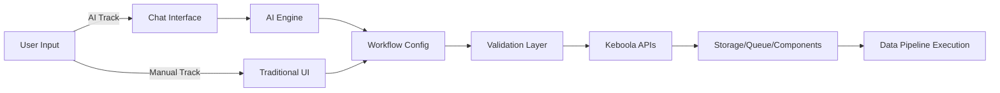

# Migration Strategy - AI-First Hybrid Approach

**Document Version**: 1.0
**Date**: 2025-10-19
**Status**: Recommendation

---

## Executive Summary

Based on comprehensive analysis of the Keboola UI codebase (Phase 2: 71 documents, 49 modules) and live UI exploration (Phase 3: 4 workflows, 12 screenshots), we recommend an **AI-First Hybrid Approach** for modernization.

This strategy combines:
1. **AI-First Innovation Track** - New conversational interface for workflow creation
2. **Selective Modernization Track** - Targeted updates to existing UI where needed
3. **Parallel Operation** - Both interfaces coexist, users choose their preference

**Key Benefit**: Positions Keboola as a next-generation data platform while preserving existing functionality and minimizing risk.

---

## Strategic Approach

### The Hybrid Model

```
┌─────────────────────────────────────────────────────────────┐
│                    Keboola Connection UI                    │
├─────────────────────────────────────────────────────────────┤
│                                                             │
│  ┌──────────────────────┐      ┌──────────────────────┐     │
│  │   AI-First Track     │      │  Modernization Track │     │
│  │  (NEW DEVELOPMENT)   │      │  (SELECTIVE UPDATES) │     │
│  ├──────────────────────┤      ├──────────────────────┤     │
│  │                      │      │                      │     │
│  │ • Chat Interface     │◄────►│ • Existing UI        │     │
│  │ • Natural Language   │      │ • Modern Components  │     │
│  │ • AI Workflow Gen    │      │ • TanStack Query     │     │
│  │ • MCP Tools          │      │ • Performance Fixes  │     │
│  │ • Visual on Demand   │      │ • Critical Bugs      │     │
│  │                      │      │                      │     │
│  └──────────────────────┘      └──────────────────────┘     │
│           ▲                              ▲                  │
│           │                              │                  │
│           └──────────┬───────────────────┘                  │
│                      │                                      │
│              ┌───────▼────────┐                             │
│              │  Shared Layer  │                             │
│              ├────────────────┤                             │
│              │ • APIs         │                             │
│              │ • Auth         │                             │
│              │ • Storage      │                             │
│              │ • Job Queue    │                             │
│              └────────────────┘                             │
└─────────────────────────────────────────────────────────────┘
```

### Why AI-First Hybrid?

**Innovation vs. Stability**:
- AI track delivers competitive differentiation
- Modernization track ensures business continuity
- Low risk: existing functionality remains intact
- High reward: transformative user experience

**User Choice**:
- Power users can continue with familiar UI
- New users start with AI assistant
- Gradual migration at user's pace
- Both interfaces produce same workflows

**Technical Validation**:
- Test AI approach with real users
- Iterate based on feedback
- Expand AI capabilities incrementally
- Sunset legacy UI only when AI proves superior

---

## Migration Principles

### 1. User-Centric

**Always prioritize user needs over technical preferences**

- Preserve existing workflows during transition
- Provide clear migration paths
- No forced changes without user benefit
- Gradual, optional adoption of new features

**Implementation**:
```yaml
User Decides:
  - Which interface to use (AI vs. Manual)
  - When to migrate workflows
  - How to learn new features
  - Whether to keep old patterns

We Provide:
  - Both options seamlessly
  - Clear documentation
  - Migration assistance
  - Training resources
```

### 2. Incremental Delivery

**Ship value continuously, not in big-bang releases**

- Weekly releases to production
- Feature flags for gradual rollout
- A/B testing of new capabilities
- Rapid iteration based on metrics

**Milestone-Based Progress**:
```yaml
Phase 1 (Foundation):
  Milestone 1: AI chat responds to simple queries
  Milestone 2: First MCP tool integrated (PostgreSQL)
  Milestone 3: AI generates basic extractor config

Phase 2 (Expansion):
  Milestone 4: AI creates complete flows
  Milestone 5: Visual flow generation from AI
  Milestone 6: Advanced transformations

Phase 3 (Integration):
  Milestone 7: AI explains existing workflows
  Milestone 8: AI optimizes performance
  Milestone 9: Full feature parity
```

### 3. Data-Driven Decisions

**Measure everything, decide based on evidence**

**Key Metrics**:
- Time to create workflow (AI vs. Manual)
- User satisfaction scores (NPS)
- Feature adoption rates
- Error rates and support tickets
- User activation and retention

**Decision Framework**:
```typescript
if (metrics.timeSavings > 50% && metrics.userSatisfaction > 4.5) {
  expandAICapabilities();
}

if (metrics.errorRate > 10% || metrics.supportTickets.increasing) {
  pauseAndIterate();
}

if (metrics.adoption < 20% after 3 months) {
  reassessApproach();
}
```

### 4. Quality Non-Negotiable

**Modern development practices from day one**

- **TypeScript**: 100% type coverage
- **Testing**: 80%+ code coverage (unit + integration)
- **Accessibility**: WCAG 2.1 AA compliance
- **Performance**: <100ms p95 response time
- **Security**: OWASP Top 10 compliance
- **Documentation**: Every feature documented

**Quality Gates**:
```yaml
Before Merge:
  - All tests passing
  - No TypeScript errors
  - Linting clean
  - Accessibility checks pass
  - Code reviewed by 2+ engineers

Before Production:
  - E2E tests passing
  - Performance benchmarks met
  - Security scan clean
  - Documentation updated
  - Product owner approval
```

### 5. AI Safety & Trust

**AI features must be reliable and transparent**

- **Explainability**: AI explains what it's doing and why
- **Validation**: All AI-generated configs validated
- **Manual Override**: Users can always edit manually
- **Audit Trail**: Log all AI decisions
- **Error Recovery**: Graceful degradation if AI fails

**Trust Framework**:
```typescript
interface AIInteraction {
  // What AI is doing
  action: "Generating SQL transformation";

  // Why AI chose this approach
  reasoning: "Based on your input schema and target format...";

  // What AI will create
  preview: TransformationConfig;

  // User controls
  userOptions: {
    accept: () => void;
    edit: () => void;
    reject: () => void;
    askForAlternative: () => void;
  };

  // Audit
  auditLog: {
    timestamp: Date;
    userPrompt: string;
    aiResponse: string;
    userDecision: "accepted" | "edited" | "rejected";
  };
}
```

### 6. Preserve Business Logic

**No functionality lost in migration**

- All 49 modules' capabilities retained
- Business rules extracted and documented
- API contracts maintained
- Backward compatibility guaranteed

**Business Rule Extraction**:
```yaml
Before Any Changes:
  1. Document business rules from code
  2. Create test suite for business logic
  3. Validate with product owners
  4. Maintain rule database

Example:
  Rule: "Snowflake workspace must have valid credentials before creation"
  Tests: 15 test cases covering validation
  Documentation: docs/business-rules/workspaces.md
  Owner: Product Manager (Workspaces)
```

### 7. Team Empowerment

**Enable teams to work independently and efficiently**

- Clear ownership boundaries
- Well-defined interfaces
- Autonomous deployment
- Shared design system
- Cross-team collaboration

**Team Structure**:
```yaml
AI Track Team:
  - 2 AI/ML Engineers (prompt engineering, LLM integration)
  - 2 Backend Engineers (MCP tools, workflow engine)
  - 1 Frontend Engineer (chat UI)
  - 1 Product Manager
  - 1 Designer

Modernization Team:
  - 3 Frontend Engineers (React, TypeScript)
  - 1 Backend Engineer (API optimization)
  - 1 Product Manager
  - 1 Designer

Shared Services:
  - Design System Team (2 engineers)
  - API Team (existing)
  - DevOps/Platform (existing)
```

---

## Parallel Tracks Detail

### Track 1: AI-First Innovation

**Objective**: Create conversational interface for workflow creation

**Technology Stack**:
```typescript
Frontend:
  - React 18.3+
  - TypeScript 5.7+
  - TailwindCSS + shadcn/ui
  - TanStack Query (data fetching)
  - Zustand (state management)

AI/LLM:
  - Claude 3.5 Sonnet (primary)
  - GPT-4 Turbo (fallback)
  - Anthropic MCP (tool integration)
  - LangChain (orchestration)

Backend:
  - Node.js (serverless functions)
  - MCP Tools (database, API, storage connectors)
  - Existing Keboola APIs (reuse 100%)
```

**Features Roadmap**:
```yaml
Phase 1 - Foundation (Months 1-3):
  - Chat interface in existing UI (sidebar)
  - Basic natural language understanding
  - Top 5 MCP tools (PostgreSQL, MySQL, S3, BigQuery, Snowflake)
  - Simple extractor configuration generation
  - Preview and manual edit capabilities

Phase 2 - Expansion (Months 4-6):
  - Complete flow creation via conversation
  - Transformation generation (SQL, Python)
  - Visual flow generation from AI config
  - Advanced MCP tools (15+ connectors)
  - AI-assisted debugging

Phase 3 - Integration (Months 7-9):
  - AI explains existing workflows
  - AI suggests optimizations
  - Real-time collaboration with AI
  - Anomaly detection and alerts
  - Full feature parity with manual UI
```

**Success Criteria**:
- 50% reduction in time to create workflows
- 70% reduction in support tickets for workflow creation
- 80% user satisfaction (NPS >50)
- 90% of common workflows automatable via AI

### Track 2: Selective Modernization

**Objective**: Fix critical issues and modernize strategic components

**Focus Areas**:
```yaml
Priority 1 - Technical Debt (Ongoing):
  - Migrate Flux stores to TanStack Query (high-impact modules)
  - Convert class components to hooks (legacy flows)
  - Remove Immutable.js (performance bottlenecks)
  - Add error boundaries (all modules)
  - Implement virtual scrolling (storage, tables)

Priority 2 - User Experience (Ongoing):
  - Improve loading states (skeleton loaders)
  - Better empty states (actionable CTAs)
  - Search improvements (fuzzy, highlighted results)
  - Mobile responsiveness (data apps, dashboard)
  - Accessibility fixes (WCAG 2.1 AA)

Priority 3 - Performance (Ongoing):
  - Bundle size optimization (code splitting)
  - React Query optimization (caching strategy)
  - API call reduction (batching, deduplication)
  - Image optimization (lazy loading)
  - Critical path CSS (faster initial load)
```

**Modules to Modernize**:
```yaml
High Priority:
  - flows-v2: Already modern, just optimize
  - storage: Add virtual scrolling, improve search
  - transformations-v2: Code editor performance
  - trash: Already excellent, use as template

Medium Priority:
  - workspaces: Improve credential management UX
  - data-apps: Better deployment feedback
  - queue: Real-time updates, better filtering

Low Priority (Wait for AI Track):
  - Legacy flows: Will be replaced by AI
  - ex-facebook: Will be AI-generated
  - Complex extractors: AI will simplify
```

**Decision Framework**:
```typescript
function shouldModernize(module: Module): boolean {
  // Don't modernize if AI will replace it
  if (module.replacedByAI && aiTrack.progress > 70%) {
    return false;
  }

  // Modernize if critical for user experience
  if (module.usage > "high" && module.userComplaints > 5) {
    return true;
  }

  // Modernize if blocking AI integration
  if (module.blockingAI) {
    return true;
  }

  // Otherwise, wait
  return false;
}
```

---

## Integration Points

### Shared Infrastructure

Both tracks use common backend services:

```yaml
Shared APIs:
  - Storage API (tables, buckets)
  - Components API (extractors, writers)
  - Queue API (job execution)
  - Orchestrator API (flows, schedules)
  - Transformations API (code execution)

Shared Authentication:
  - OAuth 2.0 (existing)
  - RBAC (existing)
  - Project permissions (existing)

Shared Design System:
  - @keboola/design (extend existing)
  - Common components
  - Consistent styling
  - Accessibility primitives
```

### Data Flow



### Communication Protocol

```typescript
// Workflows created by AI are identical to manual workflows
interface WorkflowConfig {
  // Same format regardless of creation method
  id: string;
  name: string;
  tasks: Task[];
  phases: Phase[];
  schedule?: Schedule;
  notifications?: Notification[];

  // Metadata tracks creation source
  metadata: {
    createdBy: "ai" | "manual";
    aiPrompt?: string; // If created by AI
    version: string;
  };
}

// Both UIs can edit both types of workflows
function canEdit(workflow: WorkflowConfig, user: User): boolean {
  return hasPermission(user, workflow.projectId);
  // No distinction between AI-created and manual workflows
}
```

---

## Risk Mitigation

### Technical Risks

**Risk 1: AI generates incorrect configurations**

- **Mitigation**:
  - Validation layer before execution
  - Preview + manual review required
  - Test suite for common scenarios
  - Gradual rollout with monitoring
  - Manual override always available

**Risk 2: Performance degradation from AI calls**

- **Mitigation**:
  - Streaming responses (partial results shown immediately)
  - Aggressive caching of common patterns
  - Fallback to simpler AI for simple tasks
  - User can skip AI and use manual UI

**Risk 3: Legacy UI breaks during modernization**

- **Mitigation**:
  - Comprehensive test coverage before changes
  - Feature flags for new code
  - Canary deployments (1% → 10% → 100%)
  - Instant rollback capability
  - Monitoring and alerting

### Business Risks

**Risk 1: Users reject AI interface**

- **Mitigation**:
  - AI is optional, not forced
  - Extensive user testing before launch
  - Gradual introduction with training
  - Keep manual UI available indefinitely
  - Gather feedback and iterate

**Risk 2: Development costs exceed budget**

- **Mitigation**:
  - Milestone-based funding (not time-based)
  - Clear go/no-go decision points
  - Reuse existing infrastructure (APIs, auth)
  - Small, focused team
  - Rapid prototyping to validate early

**Risk 3: Timeline slips**

- **Mitigation**:
  - Use AI to accelerate development (eat our own dog food)
  - Weekly milestones, not monthly
  - Cut scope before extending timeline
  - Continuous delivery, no big releases
  - Team autonomy reduces coordination overhead

### AI-Specific Risks

**Risk 1: LLM costs become prohibitive**

- **Mitigation**:
  - Cache common patterns aggressively
  - Use smaller models for simple tasks
  - User rate limiting
  - Cost monitoring and alerts
  - Consider self-hosted models if needed

**Risk 2: AI makes biased or harmful suggestions**

- **Mitigation**:
  - Red team testing for edge cases
  - Content filtering and safety checks
  - Human review of AI patterns
  - User feedback mechanism
  - Explicit AI limitations communicated

**Risk 3: MCP tools fail or are unavailable**

- **Mitigation**:
  - Graceful degradation to manual input
  - Tool health monitoring
  - Fallback to existing integrations
  - Clear error messages
  - Manual override always available

---

## Success Metrics

### North Star Metrics

```yaml
Primary:
  - Time to First Workflow:
      Current: 45 minutes average
      Target: 5 minutes with AI

  - User Activation Rate:
      Current: 60% create first workflow
      Target: 85% create first workflow

  - User Satisfaction (NPS):
      Current: 35
      Target: 60+

Secondary:
  - Workflow Creation per User:
      Current: 3.2 workflows/month
      Target: 8+ workflows/month

  - Support Ticket Volume:
      Current: 150 tickets/month for workflows
      Target: 50 tickets/month

  - Feature Adoption:
      Current: 40% of features used by <10% users
      Target: 60% of features used by >30% users
```

### Technical Metrics

```yaml
Performance:
  - Time to Interactive: <2 seconds
  - Chat Response Time: <500ms for first token
  - Workflow Generation Time: <3 seconds
  - Bundle Size: <200KB initial, <500KB total
  - API Response Time: p95 <100ms

Quality:
  - Test Coverage: >80%
  - TypeScript Errors: 0
  - Accessibility Score: >95 (Lighthouse)
  - Security Vulnerabilities: 0 critical, <5 medium
  - Bug Escape Rate: <2% to production

Reliability:
  - Uptime: 99.9%
  - AI Accuracy: >90% for common workflows
  - Error Rate: <1%
  - Rollback Rate: <5% of deployments
```

### Business Metrics

```yaml
Adoption:
  - AI Track Users: 20% of active users within 3 months
  - Workflows via AI: 30% of new workflows within 6 months
  - Feature Usage: 50% reduction in unused features

Efficiency:
  - Development Velocity: 2x (measured in features/month)
  - Support Cost: -30% (fewer tickets)
  - Onboarding Time: -50% (faster to productivity)

Growth:
  - New User Signups: +25% (easier platform)
  - User Retention: +15% (better UX)
  - Market Differentiation: Clear competitive advantage
```

---

## Governance

### Decision-Making Framework

```yaml
Strategic Decisions (Executive Team):
  - Go/no-go for major phases
  - Budget allocation
  - Technology vendor selection
  - Market positioning

Tactical Decisions (Product + Engineering):
  - Feature prioritization
  - Technology choices (within approved stack)
  - Team structure
  - Milestone definitions

Operational Decisions (Teams):
  - Implementation details
  - Code architecture
  - Tool selection
  - Daily priorities
```

### Review Cadence

```yaml
Weekly:
  - Team standup (progress, blockers)
  - Metrics review (dashboards)
  - Demo to stakeholders

Monthly:
  - Milestone retrospective
  - User feedback synthesis
  - Roadmap adjustment
  - Budget review

Quarterly:
  - Phase go/no-go decision
  - Strategy review
  - Competitive analysis
  - Technology assessment
```

### Quality Gates

```yaml
Before Each Milestone:
  - User testing completed (5+ users)
  - Metrics show improvement
  - No critical bugs
  - Security review passed
  - Documentation updated

Before Each Phase:
  - Previous phase goals met
  - User satisfaction positive
  - Technical debt manageable
  - Team capacity confirmed
  - Budget available
```

---

## Conclusion

The **AI-First Hybrid Approach** offers the optimal balance of innovation and stability:

- **Low Risk**: Existing UI remains functional, users migrate at their pace
- **High Reward**: Transformative AI experience positions Keboola as industry leader
- **Practical**: Builds on existing infrastructure, no full rewrite needed
- **Measurable**: Clear metrics for success, data-driven decisions
- **Flexible**: Can adjust based on feedback, not locked into rigid plan

**Next Steps**:
1. Review this strategy with stakeholders
2. Approve phased approach (next document)
3. Assemble team and allocate resources
4. Begin Phase 1 foundation work
5. Iterate based on learnings

This strategy sets Keboola on a path to becoming the most intuitive data platform on the market.
