# Flow Feature Specification

**Feature:** Flows (Data Pipeline Orchestration)
**Priority:** P0 (Core platform capability - enables all data movement)
**Complexity:** XL (AI generation + Visual editor + Real-time monitoring)
**Status:** 📋 SPECIFICATION - Phase 1 (AI-First Creation)

---

## User Goal

**Primary:** "Create and validate a data pipeline in < 5 minutes using natural language"

**User Types:**
- **Data Engineers**: Build complex multi-step ETL pipelines with transformations
- **Business Analysts**: Create simple extract-load workflows without coding
- **Data Scientists**: Orchestrate model training and inference pipelines
- **Project Managers**: Monitor pipeline health and execution status
- **New Users**: Get started without learning visual editor or config syntax

---

## Success Criteria

✅ Create flow via AI prompt in < 5 minutes (90% success rate)
✅ AI generates valid flow config 90%+ of time
✅ Mermaid diagram clearly shows pipeline structure
✅ Flow list loads in < 2 seconds
✅ Real-time execution status updates (5s polling)
✅ Works on desktop (mobile monitoring in Phase 2)
✅ Accessible (keyboard nav, screen reader support)
✅ Integrates with existing Keboola API (keboola.flow component)

---

## User Actions

**Primary:**
- Create new flow via AI chat (⌘K or button)
- Enter natural language prompt describing pipeline
- Review AI-generated Mermaid diagram for validation
- Confirm and save flow to project
- View flow list with status and schedule
- Monitor flow execution in real-time

**Secondary:**
- Edit flow name and description
- Delete flow
- Search and filter flows (by status, schedule, name)
- View flow execution history
- Navigate to flow detail page (read-only in Phase 1)

---

## Layout Hierarchy

**Visual Priority (Top to Bottom):**

```
┌────────────────────────────────────────────────────────────┐
│  Header (sticky)                                           │
│  • "Flows" title + AI badge                                │
│  • "New Flow" button (primary) + Search + Filters          │
├────────────────────────────────────────────────────────────┤
│                                                             │
│  Empty State (if no flows)                      ← 40% space│
│  • Large AI sparkle icon                                    │
│  • "Create your first flow with AI"                        │
│  • Primary CTA button                                       │
│                                                             │
│  OR                                                         │
│                                                             │
│  Flow List (grid/table view)                    ← 60% space│
│  • Cards with flow details                                  │
│  • Status badges, schedules, last run                      │
│  • Hover actions (edit, delete, run)                       │
│                                                             │
├────────────────────────────────────────────────────────────┤
│                                                             │
│  Floating AI Chat Button (bottom-right)         ← Always   │
│  • Purple gradient with glow                               │
│  • Keyboard shortcut: ⌘K                                   │
│                                                             │
└────────────────────────────────────────────────────────────┘

MODAL: AI Flow Creation (when triggered)
┌────────────────────────────────────────────────────────────┐
│  ╔══════════════════════════════════════════════════════╗ │
│  ║  AI Flow Creator                                  ⌘K  ║ │
│  ╠══════════════════════════════════════════════════════╣ │
│  ║                                                        ║ │
│  ║  Step 1: Describe Your Pipeline            ← 30% space║ │
│  ║  • Chat input with AI badge                          ║ │
│  ║  • Placeholder with examples                         ║ │
│  ║  • Submit button                                     ║ │
│  ║                                                        ║ │
│  ║  Step 2: Review Generated Flow (conditional)         ║ │
│  ║  • Detailed Mermaid diagram               ← 50% space║ │
│  ║    - Phase grouping                                   ║ │
│  ║    - Component icons and types                       ║ │
│  ║    - Color-coded connections                         ║ │
│  ║  • Generated config summary below                    ║ │
│  ║  • Edit/Regenerate/Confirm buttons                   ║ │
│  ║                                                        ║ │
│  ║  Step 3: Name and Save                    ← 20% space║ │
│  ║  • Flow name (pre-filled by AI)                      ║ │
│  ║  • Description (optional)                            ║ │
│  ║  • Folder selection (optional)                       ║ │
│  ║  • Save button                                       ║ │
│  ║                                                        ║ │
│  ╚══════════════════════════════════════════════════════╝ │
└────────────────────────────────────────────────────────────┘
```

---

## UI Sections (Specification - Phase 1)

### 1. Header (Sticky - 10%)

**Layout:** Glassmorphism header with backdrop blur (consistent with dashboard)

**Left Side:**
- Page title: "Flows" (2xl, bold, black)
- AI Badge: "AI-Powered" (subtle variant, small, positioned next to title)
- Breadcrumb: "Dashboard > Flows" (on detail pages)

**Center:**
- Search input (w-96, placeholder: "Search flows...")
- Filter dropdown: Status (All, Active, Disabled, Failed), Schedule (All, Scheduled, Manual)

**Right Side:**
- "New Flow" button (primary, gradient bg-primary-500, with Sparkles icon)
- User avatar + dropdown (consistent with dashboard)

**Design:**
- Background: `bg-white/80 backdrop-blur-lg`
- Border: `border-b border-gray-200/50`
- Sticky positioning: `sticky top-0 z-40`
- Shadow: `shadow-sm`

---

### 2. Flow List View (60% - Main Content)

**Empty State:**
- Container: Centered vertically and horizontally
- Icon: SparkleIcon (12x12, animated, AI gradient colors)
- Title: "Create your first data pipeline" (3xl, bold, black)
- Subtitle: "Use AI to describe your workflow in plain English" (gray-600)
- Example prompts (3 cards):
  - "Extract from Google Sheets, transform with dbt, write to Snowflake"
  - "Pull data from Salesforce, clean it, and push to BigQuery"
  - "Schedule a daily backup of PostgreSQL to S3"
- Primary button: "Create Flow with AI" (large, gradient, Sparkles icon)
- Secondary button: "Browse Templates" (outline, disabled for V1)

**Grid View (Default - when flows exist):**
- Layout: `grid grid-cols-1 md:grid-cols-2 lg:grid-cols-3 gap-6`
- Max width: `max-w-7xl mx-auto`
- Padding: `p-6`

**Flow Card:**
- Component: shadcn/ui Card with hover-lift effect
- Border: Dynamic based on status (success-200, error-200, gray-200)
- Top accent: 2px gradient stripe based on last run status

**Card Header:**
- Flow name (lg, bold, black, truncate)
- Status badge (top-right corner):
  - Active: `bg-success-100 text-success-700` with green dot
  - Disabled: `bg-gray-100 text-gray-700` with gray dot
  - Failed: `bg-error-100 text-error-700` with red dot + AlertTriangle icon

**Card Content:**
- Description (truncated to 2 lines, gray-600, italic if empty)
- Metadata row 1:
  - Schedule icon + "Every day at 2 AM" or "Manual" (gray-500, text-sm)
  - Component count: "5 tasks" with Activity icon
- Metadata row 2:
  - Last run: Clock icon + "2 hours ago" or "Never run"
  - Last status: CheckCircle2 (green) or XCircle (red) with status text
- Mini timeline: Last 10 runs as colored dots (green/red/gray)

**Card Footer (Actions - visible on hover):**
- Run button (Play icon, primary color)
- Edit button (Settings icon, gray)
- Delete button (Trash2 icon, red, requires confirmation)
- Dropdown: "More actions" (ellipsis) → View history, Duplicate, Export

**Hover Effects:**
- Card lifts 2px with shadow increase
- Border color intensifies
- Actions slide in from right

**Loading State:**
- Skeleton cards (3-6 cards)
- Shimmer animation
- Maintains grid layout

**Error State:**
- AlertCircle icon (red)
- "Failed to load flows" message
- "Try again" button
- Keep last cached data if available (TanStack Query)

---

### 3. AI Flow Creator Modal (Main Feature - 100% focus when open)

**Modal Container:**
- Component: shadcn/ui Dialog (full-screen on mobile, centered on desktop)
- Size: `max-w-4xl` (large modal, 75% of screen width on desktop)
- Background: White with glassmorphism overlay
- Backdrop: Dark overlay with blur (`backdrop-blur-sm bg-black/50`)
- Animation: Slide up from bottom, fade in backdrop

**Modal Header:**
- Title: "AI Flow Creator" (2xl, bold, black)
- AI Badge: Animated sparkle next to title
- Keyboard indicator: "⌘K" badge (gray, subtle, top-right)
- Close button: X icon (hover effect)

---

#### Step 1: Describe Your Pipeline (30% of modal height)

**Chat Input Section:**
- Label: "Describe your data pipeline" (lg, semibold, mb-2)
- Sublabel: "Use natural language - tell me what data you want to move and transform" (gray-600, text-sm)

**Input Field:**
- Component: Textarea (min-height: 120px, auto-expand)
- Placeholder: Multi-line example:
  ```
  E.g., "Extract customer data from Salesforce,
  transform it to clean duplicates and add
  calculated fields, then write to Snowflake"
  ```
- AI Badge: Inside input (top-right corner, subtle)
- Character count: Bottom-right (gray-400, text-xs)

**Quick Examples (Below Input):**
- Label: "Try these examples:" (gray-500, text-sm)
- 3 clickable example buttons (outline, rounded-full, text-xs):
  - "Google Sheets → dbt → Snowflake"
  - "Salesforce → Transform → BigQuery"
  - "PostgreSQL → S3 Backup"
- Click → fills input with full example

**Submit Button:**
- Label: "Generate Flow" (large, primary gradient)
- Icon: Sparkles (animated on hover)
- Loading state: Spinner + "AI is working..."
- Position: Right-aligned below input

**Error Display (if API fails):**
- Alert component (destructive variant)
- Message: "AI couldn't generate the flow. Please try rephrasing or adding more details."
- Retry button

---

#### Step 2: Review Generated Flow (50% of modal height - conditional)

**Visibility:** Only shown after AI successfully generates flow

**Section Header:**
- Title: "Review Your Pipeline" (xl, bold, black)
- Subtitle: "AI generated this flow based on your description" (gray-600)
- Action buttons (right-aligned):
  - "Edit Prompt" button (outline, arrow-left icon) → back to Step 1
  - "Regenerate" button (outline, RefreshCw icon) → call API again with same prompt

**Mermaid Diagram Container:**
- Background: `bg-gray-50` (light gray for contrast)
- Border: `border border-gray-200 rounded-lg`
- Padding: `p-6`
- Min height: 400px
- Max height: 600px (scrollable if exceeds)
- Zoom controls: + / - buttons (top-right corner, sticky)

**Mermaid Diagram Specification (Detailed - Option B):**

```mermaid
%%{init: {'theme':'base', 'themeVariables': {'primaryColor':'#EBF5FF','primaryTextColor':'#1F2937','primaryBorderColor':'#3B82F6','lineColor':'#6B7280','secondaryColor':'#F3F4F6','tertiaryColor':'#FEF3C7'}}}%%

graph TB
  subgraph Phase1["📦 Phase 1: Extract"]
    A["📊 Google Sheets Extractor<br/><small>keboola.ex-google-sheets</small>"]
  end

  subgraph Phase2["⚙️ Phase 2: Transform"]
    B["🔧 dbt Transformation<br/><small>keboola.dbt-transformation</small>"]
  end

  subgraph Phase3["💾 Phase 3: Load"]
    C["❄️ Snowflake Writer<br/><small>keboola.wr-snowflake</small>"]
  end

  A -->|Data Flow| B
  B -->|Transformed Data| C

  classDef extractClass fill:#DBEAFE,stroke:#3B82F6,stroke-width:2px
  classDef transformClass fill:#E9D5FF,stroke:#A855F7,stroke-width:2px
  classDef loadClass fill:#D1FAE5,stroke:#10B981,stroke-width:2px

  class A extractClass
  class B transformClass
  class C loadClass
```



**Mermaid Styling Rules:**
- **Extractors**: Blue background (#DBEAFE), blue border (#3B82F6), 📊 icon
- **Transformers**: Purple background (#E9D5FF), purple border (#A855F7), ⚙️ icon
- **Writers**: Green background (#D1FAE5), green border (#10B981), 💾 icon
- **Flows**: Orange background (#FED7AA), orange border (#F97316), 🔄 icon
- **Phases**: Rounded subgraph with emoji + "Phase N: [Type]"
- **Edges**: Gray with labels describing data flow
- **Font**: Small component ID below component name

**Generated Config Summary (Below Diagram):**
- Collapsible section: "View Configuration Details" (Accordion)
- When expanded, show:
  - **Phases** (3 cards in row):
    - Phase name + emoji
    - Task count
    - Dependencies
  - **Tasks** (table):
    - Component name + icon
    - Component ID (code font, copyable)
    - Configuration: "New config will be created" (V1) or "Select existing" dropdown (V2)
    - Phase assignment
  - **Execution Order**: Numbered list showing sequential execution

**Validation Messages:**
- If all valid: ✅ "All components are available in your project"
- If missing components: ⚠️ "Component X is not installed. Install it first or choose alternative."
- If prompt unclear: ℹ️ "AI made assumptions about [X]. Review carefully."

---

#### Step 3: Name and Save (20% of modal height - conditional)

**Visibility:** Shown after user clicks "Looks Good" button in Step 2

**Form Layout:**
- 2-column grid on desktop, single column on mobile
- Field spacing: `gap-4`

**Flow Name Field:**
- Label: "Flow Name" (required indicator: red asterisk)
- Input: Pre-filled with AI-generated name (editable)
  - Example: "Google Sheets to Snowflake via dbt"
- Validation: Required, max 255 chars, unique check (debounced)
- Error: "Flow name already exists" (if duplicate)

**Description Field:**
- Label: "Description" (optional)
- Textarea: Pre-filled with AI prompt (editable)
- Max height: 100px
- Character count: 500 max

**Folder Selection:**
- Label: "Folder" (optional, V1: disabled/hidden)
- Select dropdown: List of project folders
- Default: "Root" or "Flows"

**Action Buttons (Bottom-right):**
- "Cancel" button (outline, gray)
- "Save Flow" button (primary, gradient, checkmark icon)
  - Loading state: Spinner + "Saving..."
  - Success: Checkmark + "Saved!" (brief flash)
  - Error: Show error alert above buttons

**After Save Success:**
- Modal closes automatically (300ms delay)
- Toast notification: "Flow created successfully!" (success variant)
- Redirect to flow list (new flow appears at top)
- New flow card highlighted briefly (yellow glow animation)

---

### 4. Floating AI Chat Button (Always Visible)

**Reuse from Dashboard:**
- Component: FloatingChatButton (`/src/components/ai/floating-chat-button.tsx`)
- Position: `fixed bottom-6 right-6 z-50`
- Design: AI gradient (purple-blue), glow effect, pulse animation
- Icon: Sparkles (white)
- Tooltip: "Create Flow with AI (⌘K)"
- Click: Opens AI Flow Creator modal (Step 1)

**Keyboard Shortcut:**
- ⌘K (Mac) / Ctrl+K (Windows/Linux)
- Global listener on Flow list page
- Opens modal even if button not visible (scrolled off-screen)

---

### 5. Flow Detail Page (Read-Only in Phase 1)

**URL:** `/flows/:flowId`

**Layout:** Full page with sticky header

**Header:**
- Breadcrumb: Flows > [Flow Name]
- Flow name (editable inline in Phase 2)
- Status badge
- Action buttons: Run, Edit (disabled in Phase 1), Delete, Schedule

**Content Tabs:**
- **Overview** (active):
  - Mermaid diagram (same as creation, but from saved config)
  - Phase and task summary (cards)
  - Last run status and logs
  - Schedule information
- **Runs** (Phase 2): Execution history table
- **Configuration** (Phase 2): JSON/YAML view (read-only → editable)
- **Versions** (Phase 3): Version history

**Overview Tab Detail:**
- Section 1: Mermaid diagram (60% width, sticky while scrolling)
- Section 2: Configuration summary (40% width, scrollable)
  - Phases accordion
  - Tasks list
  - Variables (if any, Phase 2)
  - Notifications (if any, Phase 2)

---

## Components Used

### shadcn/ui Components:
- Dialog, DialogContent, DialogHeader, DialogTitle, DialogDescription (AI modal)
- Card, CardHeader, CardTitle, CardContent, CardFooter (flow cards)
- Button (variants: default, outline, destructive)
- Input, Textarea (form fields)
- Badge (status indicators)
- Select, SelectTrigger, SelectValue, SelectContent, SelectItem (filters, folders)
- Accordion, AccordionItem, AccordionTrigger, AccordionContent (config details)
- Alert, AlertDescription (error messages)
- Skeleton (loading states)
- Tooltip (hover hints)

### Custom Components (To Build):
- **FlowList** (`/src/app/(dashboard)/flows/page.tsx`) - Main list page
- **FlowCard** (`/src/components/flows/flow-card.tsx`) - Individual flow card
- **AIFlowCreator** (`/src/components/flows/ai-flow-creator.tsx`) - Main modal with 3 steps
- **MermaidFlowDiagram** (`/src/components/flows/mermaid-diagram.tsx`) - Renders Mermaid from config
- **FlowConfigSummary** (`/src/components/flows/config-summary.tsx`) - Shows phases/tasks/details
- **FlowDetailPage** (`/src/app/(dashboard)/flows/[id]/page.tsx`) - Read-only detail view

### Custom Components (Reuse from Dashboard):
- **FloatingChatButton** (`/src/components/ai/floating-chat-button.tsx`) - ⌘K trigger
- **SparkleIcon** (`/src/components/ui/sparkle-icon.tsx`) - AI indicator
- **AIBadge** (`/src/components/ui/ai-badge.tsx`) - AI-powered badge

### Third-Party Libraries:
- **mermaid** (`pnpm add mermaid`) - Diagram rendering
  - Version: ^10.9.0 (latest stable)
  - Usage: Client-side rendering in React component
  - Theme: Custom theme matching Keboola design system

### Lucide React Icons:
- Sparkles, Play, Settings, Trash2, MoreVertical, CheckCircle2, XCircle, AlertCircle, AlertTriangle, Clock, Activity, Database, Code, Upload, Download, RefreshCw, ArrowLeft, Search, Filter, Plus, Zap

---

## Design System Integration

### Colors (From globals.css)

**Component Type Colors (for Mermaid):**
- Extractor: `#3B82F6` (blue-500), background `#DBEAFE` (blue-100)
- Transformer: `#A855F7` (purple-500), background `#E9D5FF` (purple-100)
- Writer: `#10B981` (green-500), background `#D1FAE5` (green-100)
- Flow (nested): `#F97316` (orange-500), background `#FED7AA` (orange-100)

**Status Colors:**
- Success: `success-50` to `success-700` (green)
- Error: `error-50` to `error-700` (red)
- Warning: `warning-50` to `warning-500` (amber)
- Info: `info-50` to `info-700` (blue)
- Disabled: `gray-50` to `gray-700`

**AI Gradient:**
- Gradient: `linear-gradient(135deg, #a855f7, #3b82f6, #06b6d4)`
- Glow: `0 0 20px rgba(168, 85, 247, 0.3)`

### CSS Utility Classes (From globals.css)

**AI Effects:**
- `.bg-gradient-ai` - Animated AI gradient background
- `.text-gradient-ai` - Gradient text effect
- `.glow-ai` - Static AI glow effect

**Glassmorphism:**
- `.glass` - Light glass effect for modal backdrop

**Animations:**
- `.hover-lift` - Lift effect on card hover
- `.shimmer` - Loading shimmer effect
- `.float` - Gentle floating animation for icons

---

## Data Requirements & API Integration

### TanStack Query Hooks (To Implement)

**1. Flow List** (`useFlows`)
```typescript
GET {stackUrl}/v2/storage/components/keboola.flow/configs
Polling: 30 seconds (when on list page)
Returns: Array<{
  id: string
  name: string
  description: string
  configuration: {
    phases: Phase[]
    tasks: Task[]
  }
  isDisabled: boolean
  created: string
  version: number
}>
Used by: FlowList component
```

**2. Flow Detail** (`useFlow`)
```typescript
GET {stackUrl}/v2/storage/components/keboola.flow/configs/:id
Polling: None (static)
Returns: {
  id: string
  name: string
  description: string
  configuration: { phases, tasks }
  isDisabled: boolean
  created: string
  version: number
}
Used by: FlowDetailPage component
```

**3. AI Flow Generation** (`useGenerateFlow`)
```typescript
POST {stackUrl}/api/flows/generate
Body: {
  prompt: string
  projectId: string (from auth context)
}
Returns: {
  success: boolean
  flow: {
    name: string (AI-generated)
    description: string (original prompt)
    configuration: {
      phases: Array<{
        id: string
        name: string
        dependsOn: string[]
      }>
      tasks: Array<{
        id: string
        name: string
        componentId: string
        phase: string
        task: {
          mode: "run"
          configData: {} (empty, auto-created)
        }
      }>
    }
  }
  mermaid: string (generated Mermaid markdown)
  warnings?: string[] (if components missing, etc.)
}
Used by: AIFlowCreator component (Step 1 → Step 2)
```

**4. Create Flow** (`useCreateFlow`)
```typescript
POST {stackUrl}/v2/storage/components/keboola.flow/configs
Body: {
  name: string
  description: string
  configuration: {
    phases: Phase[]
    tasks: Task[]
  }
}
Returns: {
  id: string
  name: string
  ...
}
Used by: AIFlowCreator component (Step 3, after save)
```

**5. Delete Flow** (`useDeleteFlow`)
```typescript
DELETE {stackUrl}/v2/storage/components/keboola.flow/configs/:id
Returns: { success: boolean }
Used by: FlowCard delete action
```

**6. Run Flow** (`useRunFlow`)
```typescript
POST {stackUrl}/v2/storage/jobs
Body: {
  component: "keboola.flow"
  config: flowId
  mode: "run"
}
Returns: {
  id: string (job ID)
  status: "created"
  ...
}
Used by: FlowCard run action, FlowDetailPage run button
```

**7. Component List** (`useComponents`)
```typescript
GET {stackUrl}/v2/storage/components
Polling: None (cached for session)
Returns: Array<{
  id: string
  name: string
  type: "extractor" | "writer" | "transformation" | "application"
  icon: { 32: string, 64: string }
}>
Used by: AI validation (check if components exist)
```

### Backend API Endpoint (To Implement)

**Location:** `/src/app/api/flows/generate/route.ts` (Next.js API route)

**Purpose:** Secure AI generation endpoint (calls Claude API)

**Implementation:**
```typescript
import Anthropic from '@anthropic-ai/sdk';

export async function POST(request: Request) {
  const { prompt, projectId } = await request.json();

  // Get auth from headers (X-StorageApi-Token)
  const token = request.headers.get('X-StorageApi-Token');

  // Fetch available components from Keboola API
  const components = await fetchComponents(token, stackUrl);

  // Call Claude API with structured prompt
  const anthropic = new Anthropic({
    apiKey: process.env.ANTHROPIC_API_KEY,
  });

  const message = await anthropic.messages.create({
    model: "claude-3-5-sonnet-20241022",
    max_tokens: 4096,
    system: `You are a Keboola data pipeline expert. Generate flow configurations from user descriptions.

Available components in this project:
${JSON.stringify(components, null, 2)}

Return JSON with:
{
  "name": "Flow name",
  "description": "User's original prompt",
  "phases": [...],
  "tasks": [...],
  "mermaid": "graph TB\\n..."
}`,
    messages: [{
      role: "user",
      content: prompt
    }]
  });

  // Parse Claude response
  const flowConfig = JSON.parse(message.content[0].text);

  // Validate components exist
  const warnings = validateComponents(flowConfig.tasks, components);

  return Response.json({
    success: true,
    flow: flowConfig,
    mermaid: flowConfig.mermaid,
    warnings
  });
}
```

### Query Configuration

**Location:** `/src/lib/api/flows.ts`

**Polling Strategy:**
- Flow list: 30s (when page active)
- Flow detail: No polling (static config)
- AI generation: No polling (one-time request)
- Component list: No polling (cache for session)

**Caching:**
- Stale time: 5 minutes
- Cache time: 10 minutes
- Refetch on window focus: true
- Retry: 3 attempts with exponential backoff

**Error Handling:**
- 401: Redirect to login
- 403: Show "Permission denied" error
- 404: Show "Flow not found"
- 500: Show "Server error, please try again"
- AI generation timeout: 30 seconds max

---

## UI States (Specification)

### Loading States

**Flow List:**
- 3-6 skeleton cards in grid
- Shimmer animation
- Maintains layout structure
- Text: "Loading flows..."

**AI Flow Creator Modal:**
- Step 1: Input disabled during generation, button shows spinner
- Step 2: Mermaid skeleton (gray boxes), "AI is generating your flow..." text
- Step 3: Form disabled during save, button shows spinner

**Flow Detail Page:**
- Entire page skeleton with Mermaid placeholder
- Shimmer effect

### Error States

**Flow List:**
- AlertCircle icon (red, 6x6)
- Message: "Failed to load flows"
- "Try again" button
- Keep cached data if available

**AI Generation:**
- Alert component (destructive variant) above input
- Message: "AI couldn't generate the flow. Please try rephrasing or adding more details."
- Error details (if available): "Error: [specific error]"
- "Try Again" button → clears error, resets to Step 1

**Flow Creation:**
- Alert above action buttons
- Message: "Failed to save flow: [error reason]"
- "Retry" button

**API Errors:**
- 401: Automatic redirect to /login
- Network errors: Show error alert with retry
- Timeout: "Request timed out. Please try again."

### Empty States

**No Flows Yet:**
- Large SparkleIcon (animated, 12x12)
- Title: "Create your first data pipeline"
- Subtitle: "Use AI to describe your workflow in plain English"
- Example prompt cards (3)
- "Create Flow with AI" button

**Search/Filter No Results:**
- Search icon (gray, 6x6)
- Message: "No flows found matching '[query]'"
- "Clear filters" button

### Success States

**Flow Created:**
- Toast notification: "Flow created successfully!" (success variant, 3s duration)
- New flow card appears at top of list with highlight animation
- Yellow glow fades out over 2 seconds

**Flow Deleted:**
- Toast notification: "Flow deleted" (with Undo button, 5s duration)
- Card removed with fade-out animation

**Flow Executed:**
- Toast notification: "Flow started running" (info variant)
- Status badge updates to "Running" with spinner
- Link to job in toast: "View execution →"

---

## Responsive Design (Specification)

### Breakpoints (Tailwind)
- Mobile: < 768px (md)
- Tablet: 768px - 1024px (md to lg)
- Desktop: > 1024px (lg)

### Layout Adaptations

**Flow List Grid:**
- Desktop (lg): 3 columns (`lg:grid-cols-3`)
- Tablet (md): 2 columns (`md:grid-cols-2`)
- Mobile: 1 column (`grid-cols-1`)
- Gap: Consistent 6 units

**Header:**
- Desktop: Horizontal layout (title left, search center, button right)
- Tablet: Search below title
- Mobile: Vertical stack, full-width search and button

**AI Flow Creator Modal:**
- Desktop: max-w-4xl centered, 75% viewport width
- Tablet: max-w-2xl, 90% viewport width
- Mobile: Full-screen (100vw, 100vh), slide up from bottom

**Mermaid Diagram:**
- Desktop: Full width in modal, zoomable
- Tablet: Full width, smaller default zoom
- Mobile: Horizontal scroll if needed, pinch-to-zoom

**Flow Card:**
- All sizes: Full width of grid column
- Mobile: Taller cards (vertical layout for metadata)

---

## Accessibility (Requirements)

**Keyboard Navigation:**
- Tab through all interactive elements (cards, buttons, inputs)
- Enter to open modal, create flow, save
- Escape to close modal
- Arrow keys in search and filter dropdowns
- Focus visible on all interactive elements

**Screen Reader Support:**
- Semantic HTML: main, section, article for layout
- ARIA labels on icon-only buttons: `aria-label="Create new flow"`
- Dialog role on modal with `aria-labelledby` and `aria-describedby`
- Live regions for status updates: `aria-live="polite"` on toast notifications
- Loading states announced: "Loading flows..." (visually hidden text)
- Form errors associated with inputs via `aria-describedby`

**Color Contrast:**
- All text meets WCAG AA standards (4.5:1 for normal, 3:1 for large)
- Status indicators use icons + color (not color alone)
- Focus indicators have 3:1 contrast ratio

**Motion:**
- Respect `prefers-reduced-motion` media query
- Disable animations for users who prefer reduced motion
- Provide static alternatives for animated elements

---

## Performance (Targets)

### Build Metrics

**Bundle Size Targets:**
- Flow list page: < 25 kB (gzipped)
- AI modal component: < 15 kB (gzipped)
- Mermaid library: ~50 kB (lazy loaded only when modal opens)
- Total page bundle: < 100 kB (gzipped)

### Runtime Performance

**Load Time Targets:**
- Flow list: < 2 seconds (initial load)
- Time to Interactive: < 3 seconds
- AI generation: < 10 seconds (95th percentile)
- Modal open: < 100ms
- Mermaid render: < 1 second

**Animation Performance:**
- All animations: 60fps
- Card hover: Transform-based (GPU accelerated)
- Modal transitions: Opacity + translate (performant)

**Optimizations:**
- Lazy load Mermaid library (only when modal opens)
- React.memo on FlowCard component
- Virtualize flow list if > 100 flows (react-window)
- Debounce search input (300ms)
- TanStack Query caching prevents redundant fetches

---

## Error Handling (Strategy)

### Network Errors
- Automatic retry: 3 attempts with exponential backoff (1s, 2s, 4s)
- Display last cached data during retry (TanStack Query)
- Show error state only after all retries fail
- Retry button allows manual retry

### API Errors

**HTTP Status Codes:**
- **401 Unauthorized**: Redirect to /login (session expired)
- **403 Forbidden**: "You don't have permission to manage flows"
- **404 Not Found**: "Flow not found" (may have been deleted)
- **409 Conflict**: "Flow name already exists" (on create)
- **422 Unprocessable**: "Invalid flow configuration: [details]"
- **429 Too Many Requests**: "Rate limit exceeded. Please wait [X] seconds."
- **500 Server Error**: "Server error. Please try again later."
- **503 Service Unavailable**: "Keboola API is temporarily unavailable"

### AI Generation Errors

**Claude API Errors:**
- **Timeout** (30s): "AI generation timed out. Please try a simpler prompt."
- **Invalid response**: "AI returned invalid configuration. Please try again."
- **Rate limit**: "Too many AI requests. Please wait a moment."
- **Content filter**: "Prompt was filtered for safety. Please rephrase."

**Validation Errors:**
- **Missing components**: Warning icon + "Component X is not available. Please install it first."
- **Invalid config**: "Generated configuration is invalid: [specific error]"
- **Empty response**: "AI couldn't understand your prompt. Please add more details."

### Component Errors
- Error boundary wraps entire Flow page
- Fallback UI: "Something went wrong. Please refresh the page."
- Console logging for debugging (error details, stack trace)
- Report error to monitoring (Sentry/LogRocket in production)

### User Input Errors
- **Empty prompt**: Disable submit button, show helper text
- **Empty flow name**: Validation error below input, prevent save
- **Duplicate name**: API returns 409, show error: "Flow name already exists"
- **Special characters**: Strip or warn about invalid characters

---

## Testing Plan

### Manual Testing (Phase 1)

**Functional:**
- [ ] Create flow via AI prompt (happy path)
- [ ] AI generation with valid prompt returns correct Mermaid diagram
- [ ] Mermaid diagram displays with correct colors, icons, phases
- [ ] Config summary shows all phases and tasks
- [ ] Edit prompt regenerates flow correctly
- [ ] Save flow creates new flow in list
- [ ] Flow appears in list with correct metadata
- [ ] Delete flow removes from list with confirmation
- [ ] Search filters flows by name
- [ ] Filter dropdown filters by status and schedule
- [ ] Empty state shows when no flows exist
- [ ] Keyboard shortcut ⌘K opens modal
- [ ] Modal closes on Escape or close button

**AI Edge Cases:**
- [ ] Invalid prompt shows helpful error message
- [ ] Prompt for non-existent component shows warning
- [ ] Ambiguous prompt generates reasonable default
- [ ] Very long prompt (500+ chars) works
- [ ] Prompt with special characters handles correctly

**Non-Functional:**
- [ ] Page loads in < 2 seconds
- [ ] AI generation completes in < 10 seconds (95% of time)
- [ ] Mermaid renders in < 1 second
- [ ] Animations are smooth (60fps)
- [ ] No console errors or warnings
- [ ] TypeScript strict mode passes
- [ ] ESLint passes (0 warnings)
- [ ] Build succeeds
- [ ] Responsive design works on mobile, tablet, desktop
- [ ] Keyboard navigation works throughout

**Accessibility:**
- [ ] All interactive elements focusable
- [ ] Focus indicators visible
- [ ] Screen reader announces states correctly
- [ ] Color contrast meets WCAG AA
- [ ] Works without mouse (keyboard only)

### Automated Testing (Phase 2)

**Unit Tests (Vitest):**
- [ ] FlowCard component renders correctly
- [ ] MermaidFlowDiagram generates valid Mermaid syntax
- [ ] AIFlowCreator steps transition correctly
- [ ] Form validation works (empty name, duplicate name)

**Integration Tests (Vitest + MSW):**
- [ ] useFlows hook fetches and caches data
- [ ] useGenerateFlow hook calls backend API correctly
- [ ] useCreateFlow hook saves flow
- [ ] Error handling for API failures

**E2E Tests (Playwright):**
- [ ] Complete flow creation workflow (AI → Mermaid → Save)
- [ ] Delete flow with confirmation
- [ ] Search and filter flows
- [ ] Keyboard navigation (⌘K, Tab, Enter, Escape)

---

## Implementation Plan

### Phase 1: AI-First Flow Creation (Week 1-2) - **THIS SPRINT**

**Goal:** Users can create flows via AI and see them in a list

**Deliverables:**
1. Flow list page (`/flows`)
2. AI Flow Creator modal (3 steps)
3. Mermaid diagram renderer
4. Backend API endpoint (`/api/flows/generate`)
5. TanStack Query hooks for flows
6. Create and delete flows

**Components to Build:**
- `/src/app/(dashboard)/flows/page.tsx` - Flow list page
- `/src/components/flows/flow-card.tsx` - Flow card component
- `/src/components/flows/ai-flow-creator.tsx` - AI modal (3 steps)
- `/src/components/flows/mermaid-diagram.tsx` - Mermaid renderer
- `/src/components/flows/config-summary.tsx` - Config details
- `/src/app/api/flows/generate/route.ts` - AI generation endpoint
- `/src/lib/api/flows.ts` - TanStack Query hooks

**API Integration:**
- GET `/v2/storage/components/keboola.flow/configs` (list flows)
- POST `/v2/storage/components/keboola.flow/configs` (create flow)
- DELETE `/v2/storage/components/keboola.flow/configs/:id` (delete flow)
- POST `/api/flows/generate` (AI generation, internal)
- GET `/v2/storage/components` (component list for validation)

**Success Criteria:**
- [ ] User can click "New Flow" and describe pipeline
- [ ] AI generates Mermaid diagram in < 10 seconds
- [ ] User can review and save flow
- [ ] Flow appears in list with correct metadata
- [ ] User can delete flow

---

### Phase 2: Visual Editor (React Flow) - Week 3-4

**Goal:** Users can edit flows visually

**Deliverables:**
1. Flow detail page with React Flow canvas
2. Node components (extractor, transformer, writer)
3. Edge components (data flow, dependency)
4. Configuration sidebar (edit task settings)
5. Save/update flow functionality

**Components to Build:**
- `/src/app/(dashboard)/flows/[id]/page.tsx` - Detail page
- `/src/components/flows/flow-canvas.tsx` - React Flow wrapper
- `/src/components/flows/nodes/` - Custom node types
- `/src/components/flows/config-sidebar.tsx` - Task config panel

**API Integration:**
- GET `/v2/storage/components/keboola.flow/configs/:id` (get flow)
- PUT `/v2/storage/components/keboola.flow/configs/:id` (update flow)

---

### Phase 3: Execution Monitoring - Week 5-6

**Goal:** Users can run flows and monitor execution

**Deliverables:**
1. Run flow action (from list and detail)
2. Real-time job status updates
3. Execution history table (Runs tab)
4. Job detail view with logs

**Components to Build:**
- `/src/components/flows/execution-grid.tsx` - TanStack Table for jobs
- `/src/components/flows/job-detail.tsx` - Job logs and status

**API Integration:**
- POST `/v2/storage/jobs` (run flow)
- GET `/v2/storage/jobs?component=keboola.flow&config=:id` (job history)
- GET `/v2/storage/jobs/:jobId` (job detail)

---

### Phase 4: Grid & Calendar Views - Week 7-8

**Goal:** Multiple perspectives on flows

**Deliverables:**
1. Grid view (flows × runs matrix)
2. Calendar view (historical execution)
3. View switcher tabs

**Components to Build:**
- `/src/components/flows/grid-view.tsx`
- `/src/components/flows/calendar-view.tsx`

---

### Phase 5: Advanced Features - Week 9-10

**Goal:** V2 features (user selection of configs, etc.)

**Deliverables:**
1. Select existing configs (instead of auto-create)
2. Template library
3. Export flow as code
4. Duplicate flow

---

### Phase 6: Polish & Testing - Week 11-12

**Goal:** Production-ready

**Deliverables:**
1. Automated tests (unit, integration, E2E)
2. Performance optimizations
3. Accessibility audit
4. Documentation
5. User feedback and iteration

---

## Key Decisions & Rationale

1. **AI-First Creation** - Natural language is fastest way to get started, reduces learning curve, differentiates from competitors
2. **Backend API Endpoint** - More secure than direct Claude API calls from frontend, allows validation and logging
3. **Auto-Create Configs in V1** - Simpler implementation, users can edit later. Config selection adds complexity.
4. **Detailed Mermaid Diagrams** - Clear visualization with component types, icons, colors helps validation
5. **React Flow for Canvas** - Industry standard, proven in flows-v2, excellent performance and customization
6. **TanStack Query** - Consistent with dashboard, handles polling, caching, error recovery automatically
7. **⌘K Shortcut** - Standard for command palettes, familiar UX, accessible without mouse
8. **Read-Only Detail in Phase 1** - Faster to ship, visual editor is complex and can come in Phase 2
9. **30s Polling** - Balance between real-time updates and API load (same as dashboard)
10. **Mermaid over Custom Diagram** - Easier to implement, can export as markdown, widely supported

---

**Status:** 📋 SPECIFICATION COMPLETE - Phase 1
**Last Updated:** 2025-01-20
**Next Steps:** Begin implementation (Week 1: Flow list + AI modal)
**Estimated Completion:** Phase 1 complete in 2 weeks
