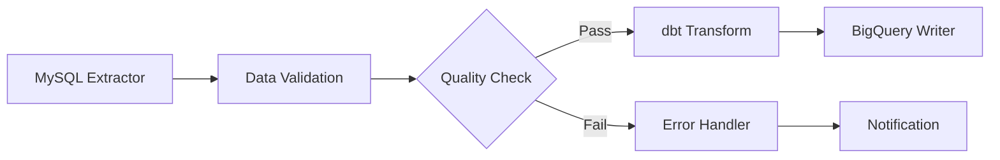

# Flow Builder UI Research - Modern Data Pipeline & Workflow Visualization

**Research Date**: 2025-10-19
**Purpose**: Gather inspiration and best practices for Keboola Flow feature redesign
**Focus**: UI patterns, visualization techniques, user experience, and AI integration

---

## Executive Summary

This research analyzed 10+ modern workflow and data pipeline builders to identify best practices for Keboola's Flow feature. Key findings:

- **React Flow/xyflow** is the dominant library for building node-based UIs (used by Stripe, Typeform, etc.)
- **n8n** sets the gold standard for workflow builder UX with instant feedback and debugging
- **AI-powered pipeline generation** is emerging as a key differentiator in 2025
- **Visual clarity** trumps complexity - successful tools balance power with simplicity
- **Dual editing modes** (visual + code) are becoming standard for technical users

### Top Recommendations for Keboola

1. **Use React Flow** as the foundation (proven, customizable, actively maintained)
2. **Implement n8n-style instant feedback** (test individual nodes, see outputs inline)
3. **Add AI pipeline generation** (natural language → flow creation)
4. **Provide dual modes**: Visual builder + Mermaid/code view
5. **Focus on debugging UX**: Failed executions should be easily debuggable

---

## 1. React Flow / xyflow - The Foundation

**URL**: https://reactflow.dev | https://xyflow.com
**Type**: Open-source React/Svelte library for node-based UIs
**Used By**: Stripe, Typeform, and thousands of projects

### Core Capabilities

**Built-in Features (Out of the Box)**:
- Drag-and-drop nodes and edges
- Zoom, pan, and viewport controls
- Single and multi-node selection
- Keyboard shortcuts (arrow keys, delete, escape)
- 4 edge types: Bezier (default), Straight, Step, SmoothStep
- Built-in node types with multi-handle support
- MiniMap component for navigation
- Background grid/dots pattern
- Controls component (zoom, fit view, lock)

**Advanced Features (React Flow Pro)**:
- **Automatic layouting**: dagre, elkjs, d3-force algorithms
- **Real-time collaboration**: yjs-based multi-user editing with cursor tracking
- **Alignment guides**: Snap-to-grid with visual alignment lines
- **Dynamic grouping**: Nested node structures

### Customization

**Custom Nodes**:
- Nodes are simply React components
- Add unlimited source/target handles
- Embed forms, charts, interactive elements
- Full control over styling and behavior

**Custom Edges**:
- Button-enabled edges
- Bi-directional edges
- Self-connecting edges
- Custom labels and styling

### UI Patterns

**Visual Enhancements (2025 Updates)**:
- Dark/light/system theme modes
- Revamped example styles with new theme system
- Node toolbar component
- Node resizer component
- Sub-flow support for hierarchical workflows

**Interaction Patterns**:
- HTML Drag-and-Drop API integration
- Pointer Events support
- Third-party library compatibility (react-draggable)
- Touch-screen optimized

### Why It Works

- **Proven at scale**: Enterprise production use (Stripe, Typeform)
- **Infinitely customizable**: Nodes are React components
- **Active development**: Regular updates, modern UI refresh in 2024-2025
- **Great DX**: TypeScript support, comprehensive docs
- **Performance**: Handles large flows efficiently

### Keboola Application

**Recommended Implementation**:
```
Foundation: @xyflow/react
Node Types:
  - ExtractorNode (data sources)
  - TransformerNode (dbt, Python, SQL)
  - WriterNode (destinations)
  - FlowControlNode (conditionals, loops)
Edge Types:
  - DataFlow (bezier) - shows data passing
  - Dependency (step) - shows execution order
Features to Implement:
  - Auto-layout (dagre for hierarchical flows)
  - MiniMap for large pipelines
  - Node grouping for complex flows
  - Custom handles for multiple data outputs
```

---

## 2. n8n - UX Excellence in Workflow Automation

**URL**: https://n8n.io
**Type**: Fair-code workflow automation platform
**Strengths**: Visual editor, instant feedback, AI integration

### Key Features

**Visual Builder**:
- Intuitive drag-and-drop node system
- 400+ pre-configured integrations
- Instant visual feedback at each step
- Real-time data preview next to settings

**Execution Model**:
- **Test individual steps**: Execute just one node, not entire workflow
- **Replay data**: Reuse previous outputs without re-triggering
- **Fast iteration**: See results immediately during design

**Debugging Excellence**:
- **Execution log**: Every workflow run tracked (first to last node)
- **Execution status**: Waiting, Running, Succeeded, Cancelled, Failed
- **Debug in editor**: Load failed execution data into editor
- **Copy to editor**: Re-run successful executions with same data
- **Test URL**: View incoming data in real-time for debugging

**Dual Mode Design**:
- **Visual mode**: Drag-and-drop for non-technical users
- **Code nodes**: JavaScript/Python for custom logic
- Best of both worlds approach

**AI Integration (2025)**:
- Natural language workflow creation
- AI suggests nodes and configurations
- Workflow refinement through conversation

### UI Patterns

**Fast Feedback Loop**:
```
User Action → Immediate Visual Response
Add node → Preview available fields
Configure → See output data
Test → Results appear inline
```

**Progressive Disclosure**:
- Simple node picker
- Configuration panel reveals on selection
- Advanced options hidden by default
- Context-aware help

**Data Flow Visualization**:
- Clear connection lines
- Data preview at each step
- Error highlighting on failed nodes
- Execution path visualization

### Why It Works

- **Non-technical friendly**: Business users can build workflows
- **Developer powerful**: Code nodes when needed
- **Debugging is first-class**: Not an afterthought
- **Self-hosted option**: Full data control
- **Open-source**: Fair-code license

### Keboola Application

**Recommended Patterns**:
1. **Inline data preview**: Show sample data next to each transformation
2. **Test individual components**: Run single extractor/transformer
3. **Replay failed jobs**: Load failed job data into editor for debugging
4. **Execution timeline**: Visual timeline of flow execution with timing
5. **AI flow builder**: "Create a flow that extracts from Snowflake, transforms with dbt, and writes to BigQuery"

**UI Mockup Concept**:
```
[Canvas Area]
├── Node: Snowflake Extractor
│   └── Output Preview: [table icon] users (1.2M rows, 15 cols)
├── Node: dbt Transformation
│   └── Output Preview: [sql icon] transformed_users.sql
└── Node: BigQuery Writer
    └── Status: [check] Written 1.2M rows

[Right Sidebar]
├── Node Configuration
├── Execution History (last 10 runs)
└── AI Assistant: "What would you like to add?"
```

---

## 3. Prefect - Modern Data Orchestration UI

**URL**: https://www.prefect.io
**Type**: Python-based workflow orchestration
**Strengths**: Monitoring, observability, task dependencies

### Architecture

**Two-Layer System**:
1. **Execution Layer**: Agents run tasks and flows
2. **Orchestration Layer**: Orion API server + UI for control

### Visualization

**Flow Run Graph**:
- Tasks displayed as nodes
- Dependencies shown as edges
- Enables granular control and understanding
- Break down complex flows into observable parts

**Monitoring Features**:
- Web-based interface for visualizing flow runs
- Detailed logging and event tracking
- Performance monitoring
- Critical event notifications

### UI Capabilities

**User-Friendly Interface**:
- Monitor workflows in real-time
- Detailed execution logs
- Debug issues with full visibility
- Track performance metrics

**Used By**: Fortune 50 (Progressive Insurance) + startups (Cash App)

### Why It Works

- **Python-native**: Fits data engineering workflows
- **Observability-first**: Every execution tracked
- **Enterprise-ready**: Used at scale
- **Modern architecture**: API-first design

### Keboola Application

**Recommended Patterns**:
1. **Task dependency graph**: Visual representation of flow dependencies
2. **Real-time monitoring**: Live status updates during execution
3. **Execution history**: Searchable, filterable run history
4. **Performance metrics**: Duration, resource usage per task
5. **Alert system**: Notify on failures/anomalies

---

## 4. Apache Airflow - DAG Visualization Pioneer

**URL**: https://airflow.apache.org
**Type**: Workflow management platform (Python DAGs)
**Strengths**: Multiple visualization views, mature ecosystem

### Key Views

**Graph View** (Primary):
- Shows logical DAG structure
- Task connections and dependencies
- Branching and retry logic
- Color-coded status:
  - Green: Success
  - Red: Failed
  - Yellow: Running
  - Gray: Pending

**Grid View**:
- Column = DAG run
- Square = Task instance
- Interactive debugging interface
- Color-coded task states
- Primary interface for inspection

**Calendar View**:
- Long-term execution history
- Monthly/yearly perspective
- Hourly view for given month
- Daily view for entire year
- Visualize run activity patterns

### UI Evolution (Airflow 3.0 - 2025)

**Modern Redesign**:
- Built with React + FastAPI
- Dark/light theme support
- Intuitive navigation
- Enhanced grid view
- Better task status visibility
- Improved workflow visualization

**Amazon MWAA Enhancements**:
- Completely redesigned interface
- Simplified workflow orchestration
- More intuitive navigation
- Enhanced visibility into task history

### Core Concepts

**DAG as Graph**:
- Nodes = Tasks
- Edges = Dependencies
- Visual representation aids understanding
- Easy to navigate and conceptualize

### Why It Works

- **Multiple perspectives**: Graph, Grid, Calendar views
- **Mature**: Battle-tested in production
- **Flexible**: Python-based DAG definition
- **Large ecosystem**: Extensive operator library

### Keboola Application

**Recommended Patterns**:
1. **Multiple view modes**:
   - Graph view: Flow design/understanding
   - Grid view: Execution monitoring
   - Calendar view: Historical patterns
2. **Color-coded status**: Instant visual feedback
3. **Task-level detail**: Click any task for logs/config
4. **DAG versioning**: Track flow changes over time
5. **Retry visualization**: Show retry attempts in graph

**View Switching UI**:
```
[View Tabs]
Graph | Grid | Calendar | Code | Logs

Graph View:
  └── Visual flow diagram with real-time status

Grid View:
  └── Matrix of runs × tasks with status colors

Calendar View:
  └── Heat map of execution frequency/success
```

---

## 5. Zapier & Make.com - Consumer-Grade UX

**URL**: https://zapier.com | https://make.com
**Type**: No-code automation platforms
**Strengths**: Simplicity, visual clarity, non-technical users

### Zapier's Visual Editor

**Flowchart-Like UI**:
- Replaced simple list with visual flowchart
- See every path and action clearly
- Nested paths visible at a glance
- Drag-and-drop editing

**Key Features**:
- **Path management**: Rename paths for context
- **Path duplication**: Copy entire paths including sub-paths
- **Notes feature**: Add context to each step
- **Visual branching**: If/else logic clearly shown

**Design Philosophy**:
- Clean, guided step-by-step experience
- Accessible for beginners
- Progressive complexity

### Make.com's Visual Interface

**Drag-and-Drop Builder**:
- Entire workflow visible in one view
- Real-time testing and adjustment
- Visual mapping of data flow
- Parallel processing capabilities

**Testing**:
- Test workflows as you build
- See data flow in real-time
- Immediate debugging feedback
- Easy troubleshooting

### Why They Work

- **Non-technical users**: Business users can build complex automations
- **Visual clarity**: See entire workflow at once
- **Real-time feedback**: Test as you go
- **Pre-built templates**: Start from examples

### Keboola Application

**Recommended Patterns**:
1. **Visual path branching**: Clear if/else flows
2. **Step notes**: Document business logic inline
3. **Template library**: Pre-built flow templates
4. **Path duplication**: Clone common patterns
5. **Guided setup**: Wizard-like experience for beginners

**Beginner Mode UI**:
```
[Step 1] Choose Data Source
  └── [Template Gallery] or [Start From Scratch]

[Step 2] Select Transformation
  └── [Recommended] | [All Options]

[Step 3] Choose Destination
  └── [Popular] | [All Destinations]

[Preview] → [Save as Template] → [Run]
```

---

## 6. AWS Step Functions - Enterprise Visual Designer

**URL**: https://aws.amazon.com/step-functions
**Type**: Serverless workflow orchestration
**Strengths**: Low-code visual tool, enterprise patterns

### Workflow Studio

**Three Modes**:
1. **Design**: Drag-and-drop states onto canvas
2. **Code**: Built-in ASL (Amazon States Language) editor
3. **Config**: Workflow configuration management

**Design Approach**:
- Visual designer for prototyping
- Share with stakeholders quickly
- Export to infrastructure-as-code (AWS SAM)
- Generate boilerplate for developers

### Best Practices (AWS Recommended)

**Modular Design**:
- Break workflows into reusable components
- Sub-workflows for common patterns
- Pattern library for standard tasks

**Reliability**:
- Use timeouts (default: none - dangerous!)
- Idempotent tasks with retries
- Comprehensive error handling

**Error Handling**:
- Catch and retry strategies
- Fallback workflows
- Return exceptions for Step Function management

**Monitoring**:
- AWS CloudWatch integration
- Performance tracking
- Execution monitoring

### Step Functions Workflow Collection

**Pre-built Patterns**:
- Best practice templates
- Reusable building blocks
- Patterns tab in designer
- Copy and customize

### Why It Works

- **Enterprise-grade**: AWS scale and reliability
- **Visual + code**: Dual editing modes
- **Pattern library**: Don't reinvent the wheel
- **Infrastructure integration**: CloudFormation/SAM

### Keboola Application

**Recommended Patterns**:
1. **Pattern library**: Pre-built flow templates (ETL, CDC, etc.)
2. **Sub-flows**: Reusable transformation groups
3. **Timeout enforcement**: Prevent stuck jobs
4. **Retry strategies**: Configurable retry logic per component
5. **CloudWatch-style monitoring**: Metrics and logs integration

**Pattern Library Example**:
```
[Patterns]
├── ETL Patterns
│   ├── Full Load (Source → Transform → Destination)
│   ├── Incremental Load (CDC)
│   └── Slowly Changing Dimensions
├── Transformation Patterns
│   ├── dbt + Python
│   ├── SQL Chain
│   └── Data Quality Checks
└── Orchestration Patterns
    ├── Parallel Extraction
    ├── Sequential with Dependencies
    └── Conditional Branching
```

---

## 7. Azure Logic Apps - Workflow Designer

**URL**: https://azure.microsoft.com/logic-apps
**Type**: Cloud workflow designer
**Strengths**: Visual design, connector gallery, dual view

### Designer Features

**Visual Workflow Builder**:
- Drag-and-drop interface
- Add, edit, delete steps visually
- Azure portal or VS Code
- Switch between designer and JSON

**Workflow Structure**:
- Start with trigger
- Add actions sequentially
- Underlying JSON definition
- Dual-mode editing (visual ↔ code)

**Connector Gallery**:
- 1,400+ pre-built connectors
- User-friendly interface
- Standard web browser access
- No installation required

### Why It Works

- **Massive connector library**: Connect to anything
- **Enterprise integration**: Azure ecosystem
- **Dual editing**: Visual for beginners, JSON for experts
- **Cloud-native**: No infrastructure management

### Keboola Application

**Recommended Patterns**:
1. **Connector gallery UI**: Visual picker for extractors/writers
2. **Trigger + action model**: Clear flow initiation
3. **JSON export**: Export flows as code
4. **Template marketplace**: Share flows across organization

---

## 8. AI-Powered Pipeline Generation (2025 Trends)

**Research Focus**: How AI is transforming data pipeline creation

### Market Adoption

**Statistics (2025)**:
- **80%+ enterprises** will use AI-driven automation for pipelines
- **60-70%** reduction in time spent on routine maintenance
- **40-50%** decrease in data engineering costs
- **75-85%** faster deployment of new workflows

### Key Capabilities

**Self-Healing Pipelines**:
- AI monitors pipeline health continuously
- Automatically identifies and fixes failures
- Reduces downtime and operational costs
- Predictive failure detection

**Natural Language Generation**:
- Generate complete ETL code from text descriptions
- Example: "Extract from Snowflake, transform with dbt, write to BigQuery"
- AI generates full pipeline configuration
- Reduces time from days to minutes

**Intelligent Automation**:
- **Dynamic adaptation**: Auto-adjust to schema changes
- **Predictive maintenance**: Fix errors before they disrupt
- **No-code for non-technical**: Business users build pipelines
- **Cost optimization**: AI recommends resource allocation

### Leading Platforms (2025)

**Mage AI**:
- Magical data engineering workflows
- AI-powered pipeline generation
- Visual interface + Python SDK
- Self-healing capabilities

**Databricks Lakeflow Designer**:
- No-code ETL builder
- Natural language support
- Drag-and-drop + AI generation
- Powered by Data Intelligence Platform

**dbt Labs**:
- AI-assisted transformation logic
- Semantic layer generation
- Documentation auto-generation

### AI Integration Patterns

**Conversation-Driven**:
```
User: "I need to sync Salesforce to Snowflake daily"
AI: "I'll create a flow with:
     1. Salesforce extractor (daily schedule)
     2. Data validation step
     3. Snowflake writer
     Would you like to add data quality checks?"
User: "Yes, check for duplicates"
AI: "Added deduplication step. Flow ready to run."
```

**Code Generation**:
```
User: "Generate dbt model for customer lifetime value"
AI: [Generates SQL model with:
     - Customer aggregation
     - Revenue calculation
     - Date windowing
     - Documentation
     - Tests]
```

**Auto-Optimization**:
```
AI detects: "Your pipeline is processing 10M rows sequentially"
AI suggests: "Switch to parallel processing for 5x speedup"
AI implements: [Refactors to parallel architecture]
```

### Why It's Important

- **Democratization**: Non-technical users build pipelines
- **Speed**: 10x faster development
- **Quality**: AI applies best practices automatically
- **Cost**: Reduced need for specialized talent

### Keboola Application

**Recommended Implementation**:

**Phase 1: AI Assistant**:
- Chat interface in flow builder
- Suggest next steps
- Explain existing flows
- Debug failures

**Phase 2: AI Generation**:
- Natural language → flow creation
- "Create CDC pipeline from MySQL to BigQuery"
- AI configures extractors, transformations, writers

**Phase 3: AI Optimization**:
- Analyze execution patterns
- Suggest performance improvements
- Auto-implement optimizations (with approval)
- Predict and prevent failures

**UI Integration**:
```
[Flow Canvas]
├── AI Chat Floating Button (⌘K to open)
├── "AI Assist" on each node (suggests configs)
└── "Optimize Flow" button (AI analysis)

[AI Chat Interface]
User: "Add email notification on failure"
AI: [Adds notification node, configures SMTP]
    "Email notification added. Test email?"
```

---

## 9. Mermaid Diagrams - Code-Based Visualization

**URL**: https://mermaid.js.org
**Type**: Markdown-inspired diagram generation
**Strengths**: Text-to-diagram, version control friendly

### Capabilities

**Diagram Types**:
- Flowcharts
- UML diagrams
- Git graphs
- User journey diagrams
- Gantt charts
- Pipeline visualizations

**Pipeline Use Cases**:
- ETL/data pipeline visualization
- CI/CD pipeline diagrams
- Dependency graphs
- Workflow documentation

### Integration

**GitHub Support**:
- Native Mermaid rendering in Markdown
- No external tools needed
- Version controlled diagrams

**Mermaid Live Editor**:
- Online editor (mermaid.live)
- Real-time preview
- Export to PNG/SVG

**VS Code**:
- Extensions for preview
- Syntax highlighting
- Live editing

### Example: Data Pipeline



### Why It's Useful

- **Code-based**: Version control friendly
- **Lightweight**: No heavy tools needed
- **Shareable**: Markdown files with diagrams
- **Documentation**: Self-documenting pipelines

### Keboola Application

**Recommended Use**:
1. **Export flows as Mermaid**: Copy flow as text diagram
2. **Documentation**: Auto-generate flow docs
3. **Version control**: Track flow changes in Git
4. **Import flows**: Paste Mermaid to create visual flow
5. **Sharing**: Send flow diagrams in tickets/docs

**Export Feature**:
```
[Flow Menu]
└── Export
    ├── As JSON (API format)
    ├── As Mermaid (documentation)
    ├── As PNG (screenshot)
    └── As Template (reusable)
```

---

## 10. Visual Flow Builder Best Practices (Cross-Platform Analysis)

### Core UX Patterns

**1. Progressive Disclosure**:
- Simple by default, powerful when needed
- Hide advanced options until requested
- Context-aware UI (show relevant options)
- Don't overwhelm beginners

**2. Immediate Feedback**:
- Show results as users build
- Inline data previews
- Real-time validation
- Error highlighting

**3. Consistent Visual Language**:
- Color coding for status (green/red/yellow/gray)
- Icons for node types
- Edge styles for relationship types
- Standard interaction patterns

**4. Multiple Perspectives**:
- Graph view: Understand structure
- Grid view: Monitor execution
- Code view: Fine-tune details
- Calendar view: Historical patterns

**5. Guided Experiences**:
- Templates for common patterns
- Wizards for complex setups
- Tooltips and inline help
- Onboarding flows

### Interaction Best Practices

**Canvas Navigation**:
- **Zoom**: Mouse wheel or pinch
- **Pan**: Drag empty canvas or two-finger drag
- **MiniMap**: Overview with interactive viewport
- **Fit to view**: Reset zoom to show entire flow
- **Keyboard shortcuts**: Arrow keys, delete, escape

**Node Selection**:
- **Single click**: Select node
- **Shift+click**: Multi-select
- **Drag box**: Lasso selection
- **Ctrl+A**: Select all
- **Escape**: Deselect

**Node Configuration**:
- **Click node**: Show config panel
- **Right-click**: Context menu
- **Double-click**: Open full editor
- **Drag handle**: Connect to other nodes

**Visual Affordances**:
- **Hover effects**: Highlight interactive elements
- **Connection previews**: Show valid connection targets
- **Snap to grid**: Align nodes automatically
- **Alignment guides**: Visual helpers for layout

### Node Configuration Patterns

**Common Approaches**:

**1. Right Sidebar** (n8n, Make.com):
```
[Canvas: 70%] [Config Panel: 30%]
```
- Always visible
- Context switches on node selection
- Keeps flow in view

**2. Modal/Overlay** (Zapier):
```
[Canvas] + [Full-Screen Config Modal]
```
- Focus on single node
- More space for complex config
- Hide flow during setup

**3. Inline Panel** (Some tools):
```
[Canvas with Expandable Node Cards]
```
- Config within node itself
- No context switching
- Limited space for details

**Keboola Recommendation**: **Right Sidebar** (70/30 split)
- Best for complex configs (extractors, transformations)
- Keeps flow visible
- Can collapse to 80/20 or full-screen canvas

### Edge Handling Patterns

**Connection Creation**:
1. **Drag from handle**: Most common, intuitive
2. **Click source, click target**: Alternative for precision
3. **Keyboard navigation**: Accessibility

**Edge Types**:
- **Bezier curves**: Smooth, organic (default)
- **Straight lines**: Direct, simple
- **Step/orthogonal**: Clean, grid-aligned
- **Smooth step**: Rounded corners

**Visual Encoding**:
- **Line thickness**: Data volume
- **Color**: Data type or status
- **Animation**: Active data flow
- **Dotted**: Conditional/optional

**Invalid Connections**:
- **Red highlight**: Invalid target
- **Disable drop**: Prevent bad connections
- **Validation message**: Explain why invalid

### Layout Strategies

**Manual Layout** (Zapier, n8n):
- User places nodes
- Drag to arrange
- Best for custom visualization

**Auto-Layout** (React Flow Pro, Airflow):
- Algorithm positions nodes (dagre, elkjs, d3-force)
- Hierarchical or force-directed
- Best for large flows

**Hybrid** (Recommended for Keboola):
- Auto-layout on creation
- Manual adjustment allowed
- "Re-layout" button to reset

### Debugging UX Patterns

**Execution Visualization**:
- **Animate execution**: Highlight active nodes
- **Progress bar**: Show % complete
- **Timing info**: Duration per node
- **Log stream**: Real-time output

**Error Handling**:
- **Red node outline**: Failed task
- **Error icon**: Click for details
- **Stack trace**: Developer info
- **Suggested fixes**: AI-powered suggestions

**Re-run Failed Executions**:
- **Load execution data**: Replay with same inputs
- **Edit and retry**: Fix flow, re-run
- **Compare runs**: Before/after view

---

## Comprehensive Recommendations for Keboola Flow

### Architecture

**Foundation**: React Flow (@xyflow/react)
- Proven, customizable, actively maintained
- Used by Stripe, Typeform, thousands of projects
- Built-in features save development time
- Pro version for auto-layout and collaboration

### Feature Priorities

**Phase 1: Core Flow Builder** (MVP)

**Canvas & Navigation**:
- [x] React Flow integration
- [x] Zoom, pan, viewport controls
- [x] MiniMap for large flows
- [x] Keyboard shortcuts
- [x] Dark/light theme

**Node Types**:
- [x] ExtractorNode (data sources)
- [x] TransformerNode (dbt, Python, SQL)
- [x] WriterNode (destinations)
- [x] FlowControlNode (conditional, branch)

**Edges**:
- [x] Bezier curves (default)
- [x] Straight lines (optional)
- [x] Color-coded by data type
- [x] Animated during execution

**Configuration UI**:
- [x] Right sidebar (70/30 split)
- [x] Collapsible to full canvas
- [x] Form validation
- [x] Field-level help

**Execution**:
- [x] Run entire flow
- [x] Real-time status updates
- [x] Basic error handling

**Phase 2: Debugging & Testing** (3-6 months)

**n8n-Inspired Features**:
- [ ] Test individual nodes
- [ ] Inline data preview (sample outputs)
- [ ] Replay execution data
- [ ] Debug failed executions
- [ ] Execution timeline

**Monitoring**:
- [ ] Grid view (runs × tasks)
- [ ] Calendar view (historical)
- [ ] Execution logs
- [ ] Performance metrics

**Phase 3: AI Integration** (6-12 months)

**AI Assistant**:
- [ ] Chat interface (⌘K shortcut)
- [ ] Natural language flow creation
- [ ] Suggest next steps
- [ ] Explain existing flows
- [ ] Debug with AI

**AI Generation**:
- [ ] "Create flow that..." → full pipeline
- [ ] Auto-configure extractors/writers
- [ ] Generate transformation logic
- [ ] Optimize flow performance

**Phase 4: Advanced Features** (12+ months)

**Collaboration**:
- [ ] Real-time multi-user editing (yjs)
- [ ] Cursor tracking
- [ ] Change history
- [ ] Comments on nodes

**Templates & Patterns**:
- [ ] Pattern library (ETL, CDC, etc.)
- [ ] Template marketplace
- [ ] Export/import flows
- [ ] Version control integration

**Advanced Visualization**:
- [ ] Sub-flows/grouping
- [ ] Multiple view modes
- [ ] Flow comparison
- [ ] Dependency analysis

### UI Design Specifications

**Color Coding** (Status):
```
Success:  #22c55e (green)
Failed:   #ef4444 (red)
Running:  #f59e0b (yellow)
Pending:  #6b7280 (gray)
Disabled: #9ca3af (light gray)
```

**Node Types** (Visual Differentiation):
```
Extractor:   Blue (#3b82f6) + database icon
Transformer: Purple (#a855f7) + code icon
Writer:      Green (#10b981) + upload icon
Flow Control: Orange (#f97316) + branch icon
```

**Edge Types**:
```
Data Flow:       Bezier, solid, blue
Dependency:      Straight, solid, gray
Conditional:     Bezier, dashed, orange
Error Handler:   Straight, dotted, red
```

**Spacing & Layout**:
```
Node padding:    16px
Node gap:        80px (horizontal), 60px (vertical)
Handle size:     12px
Edge width:      2px (normal), 3px (selected)
Canvas padding:  40px
```

### Component Structure

**Flow Builder Page**:
```
<FlowBuilderPage>
  <Header>
    <Breadcrumb /> flow name
    <Actions>
      <Button>Run Flow</Button>
      <Button>Schedule</Button>
      <Button>Export</Button>
      <Dropdown>More</Dropdown>
    </Actions>
  </Header>

  <Main>
    <LeftToolbar width="60px">
      <IconButton>Extractors</IconButton>
      <IconButton>Transformers</IconButton>
      <IconButton>Writers</IconButton>
      <IconButton>Controls</IconButton>
    </LeftToolbar>

    <Canvas width="70%">
      <ReactFlow
        nodes={nodes}
        edges={edges}
        nodeTypes={nodeTypes}
        edgeTypes={edgeTypes}
      >
        <Background />
        <Controls />
        <MiniMap />
      </ReactFlow>

      <FloatingActionButton>
        AI Assistant
      </FloatingActionButton>
    </Canvas>

    <RightSidebar width="30%" collapsible>
      {selectedNode ? (
        <NodeConfiguration node={selectedNode} />
      ) : (
        <FlowProperties flow={currentFlow} />
      )}
    </RightSidebar>
  </Main>

  <Footer>
    <ExecutionStatus />
    <ViewSwitcher>Graph | Grid | Code</ViewSwitcher>
  </Footer>
</FlowBuilderPage>
```

### Key Interactions

**Creating a Flow** (Beginner-Friendly):
```
1. Click "New Flow" or choose template
2. [AI Option] "Describe your flow" → AI generates
   [Manual] Drag nodes from left toolbar
3. Connect nodes by dragging handles
4. Click node to configure in right sidebar
5. Click "Run Flow" to test
6. See real-time execution status
7. Debug failures inline
8. Save and schedule
```

**Debugging a Failed Flow**:
```
1. Failed execution notification appears
2. Click "Debug" → Flow opens with execution data
3. Failed nodes highlighted in red
4. Click failed node → Error details in sidebar
5. See input data, error message, stack trace
6. [AI Option] "Suggest fix" → AI recommends changes
7. Edit configuration or transformation logic
8. Click "Re-run with same data" to test fix
9. Compare before/after results
10. Save fixed flow
```

**AI-Powered Flow Creation**:
```
1. Click AI Assistant (or press ⌘K)
2. Type: "Extract from Snowflake, transform with dbt, write to BigQuery"
3. AI creates:
   - Snowflake Extractor node (queries users table)
   - dbt Transformer node (creates sample model)
   - BigQuery Writer node (configures destination)
4. Review AI-generated flow
5. Click "Refine" to adjust
6. AI: "What transformations should dbt apply?"
7. User: "Calculate customer lifetime value"
8. AI updates dbt model with CLV logic
9. Click "Test Flow" → AI runs with sample data
10. Review results → Save flow
```

### Testing Individual Nodes (n8n Pattern)

**Implementation**:
```
<Node>
  <NodeHeader>
    <Icon />
    <Title>Snowflake Extractor</Title>
    <Status>Ready</Status>
  </NodeHeader>

  <NodeBody>
    <Handles>
      <TargetHandle />
      <SourceHandle />
    </Handles>
  </NodeBody>

  <NodeFooter>
    <Button size="sm" onClick={testNode}>
      Test Node
    </Button>
    <DataPreview rows={5} />
  </NodeFooter>
</Node>
```

**Behavior**:
1. Click "Test Node" on Snowflake Extractor
2. Node executes query independently
3. Sample data appears below node (5 rows)
4. See data structure: columns, types, values
5. No need to run entire flow
6. Iterate quickly on configuration

### Multiple View Modes

**Graph View** (Primary):
- Visual flow diagram
- Node status colors
- Real-time execution
- Drag-and-drop editing

**Grid View** (Monitoring):
- Rows = Flow executions
- Columns = Tasks/Nodes
- Color-coded cells (status)
- Click cell → Task details

**Code View** (Advanced):
- JSON/YAML flow definition
- Syntax highlighting
- Edit directly
- Sync with visual view

**Calendar View** (Historical):
- Monthly/yearly execution history
- Heat map of success/failure
- Identify patterns
- Click day → Executions

**View Switcher**:
```
<Tabs>
  <Tab active>Graph</Tab>
  <Tab>Grid</Tab>
  <Tab>Code</Tab>
  <Tab>Calendar</Tab>
</Tabs>
```

### Auto-Layout vs Manual

**Strategy**: Hybrid Approach

**On Flow Creation**:
- Apply dagre layout algorithm
- Hierarchical top-to-bottom
- Left-to-right for parallel tasks
- Evenly spaced, aligned

**User Control**:
- Drag nodes to custom positions
- Layout algorithm respects manual moves
- "Re-layout" button to reset
- "Lock layout" to prevent auto-adjust

**Smart Layout**:
- When adding node: Suggest position
- When connecting: Suggest optimal routing
- When grouping: Auto-arrange group contents

### Template Library

**Categories**:
```
ETL Patterns
├── Full Load (Source → Transform → Destination)
├── Incremental Load (CDC with watermark)
├── SCD Type 2 (Slowly Changing Dimensions)
└── Data Quality Pipeline (Extract → Validate → Transform → Write)

Transformation Patterns
├── dbt + Python Hybrid
├── SQL Transformation Chain
├── Data Cleaning Pipeline
└── Feature Engineering

Orchestration Patterns
├── Parallel Extraction (Multiple sources)
├── Sequential with Dependencies
├── Conditional Branching (if/else)
└── Error Handling with Retry

Integration Patterns
├── Salesforce → Snowflake
├── MySQL → BigQuery
├── API → Data Lake
└── File Upload → Transform → DB
```

**Template UI**:
```
<TemplateGallery>
  <Search placeholder="Search templates..." />
  <Filters>
    <Category>All | ETL | Transform | Orchestration</Category>
    <Complexity>Beginner | Intermediate | Advanced</Complexity>
  </Filters>
  <Grid>
    <TemplateCard>
      <Thumbnail>Flow preview image</Thumbnail>
      <Title>Full Load ETL</Title>
      <Description>Extract, transform, load pattern</Description>
      <Meta>
        <Badge>Beginner</Badge>
        <Badge>3 nodes</Badge>
        <Badge>~5 min setup</Badge>
      </Meta>
      <Button>Use Template</Button>
    </TemplateCard>
  </Grid>
</TemplateGallery>
```

### Error Handling & Validation

**Connection Validation**:
```
Valid:   Extractor → Transformer → Writer
Invalid: Writer → Extractor (shows red highlight)
Warning: Transformer → Transformer (shows yellow, allowed but confirm)
```

**Configuration Validation**:
```
Required fields:   Red border + error message
Invalid format:    Yellow border + warning
Suggestions:       Blue info icon + hint
```

**Runtime Errors**:
```
<ErrorNode>
  <Icon color="red">alert-circle</Icon>
  <Message>Query failed: Table not found</Message>
  <Actions>
    <Button>View Logs</Button>
    <Button>Retry</Button>
    <Button>Ask AI</Button>
  </Actions>
</ErrorNode>
```

### Performance Optimization

**Large Flows**:
- Virtualization for 100+ nodes
- Progressive loading
- Lazy render off-screen nodes
- Optimize re-renders

**Real-Time Updates**:
- WebSocket for execution status
- Throttle updates (100ms)
- Batch status changes
- Optimize React Flow state

**Data Preview**:
- Limit to 10-20 rows
- Lazy load full data on demand
- Cache preview results
- Pagination for large datasets

---

## Competitive Analysis Summary

| Tool | Strength | Weakness | Keboola Fit |
|------|----------|----------|-------------|
| **React Flow** | Customizable foundation, proven scale | Requires custom implementation | ✅ Primary library |
| **n8n** | Best-in-class debugging UX | Focused on integrations | ✅ Copy UX patterns |
| **Prefect** | Python-native, monitoring | Requires coding | ⚠️ Monitoring inspiration |
| **Airflow** | Multiple views, mature | Complex setup | ✅ Copy view modes |
| **Zapier** | Simplest for beginners | Limited power | ✅ Beginner mode inspiration |
| **Make.com** | Visual clarity | Less enterprise features | ⚠️ Visual design ideas |
| **AWS Step Functions** | Pattern library, enterprise | AWS-locked | ✅ Copy pattern approach |
| **Azure Logic Apps** | Huge connector library | Azure-locked | ⚠️ Connector UI ideas |
| **Mage AI** | AI-powered generation | Newer, less proven | ✅ AI integration approach |
| **Mermaid** | Code-based, version control | Not interactive | ✅ Export format |

---

## Implementation Roadmap

### Month 1-2: Foundation
- [ ] Integrate React Flow
- [ ] Build custom node components
- [ ] Implement drag-and-drop from toolbar
- [ ] Create configuration sidebar
- [ ] Basic execution (run entire flow)

### Month 3-4: Core Features
- [ ] Multiple node types (extractors, transformers, writers)
- [ ] Edge validation and routing
- [ ] Real-time execution status
- [ ] Error handling and retry logic
- [ ] Save/load flows

### Month 5-6: Debugging & Testing
- [ ] Test individual nodes (n8n pattern)
- [ ] Inline data preview
- [ ] Execution history/logs
- [ ] Grid view for monitoring
- [ ] Failed execution debugging

### Month 7-9: Advanced Visualization
- [ ] Auto-layout (dagre integration)
- [ ] MiniMap and navigation controls
- [ ] Calendar view for historical data
- [ ] Code view (JSON/YAML export)
- [ ] Flow comparison

### Month 10-12: AI Integration
- [ ] AI chat interface
- [ ] Natural language flow creation
- [ ] Auto-suggest next nodes
- [ ] AI-powered debugging
- [ ] Flow optimization recommendations

### Month 13+: Polish & Scale
- [ ] Template library
- [ ] Real-time collaboration (yjs)
- [ ] Performance optimization
- [ ] Advanced error handling
- [ ] Analytics and insights

---

## Key Takeaways

### What Makes Flow Builders Successful

1. **Visual Clarity**: Users should understand the flow at a glance
2. **Immediate Feedback**: See results as you build, not after
3. **Progressive Disclosure**: Simple for beginners, powerful for experts
4. **Debugging First**: Make failures easy to understand and fix
5. **Multiple Perspectives**: Graph/Grid/Calendar views for different needs
6. **AI Integration**: Natural language generation is the future

### What to Avoid

1. **Complexity First**: Don't show everything upfront
2. **Poor Error Messages**: "Something went wrong" is not helpful
3. **No Testing**: Must test individual components
4. **Single View**: Need multiple visualization modes
5. **Manual Only**: AI assistance is now expected

### Keboola's Competitive Edge

**Current Strengths to Preserve**:
- Comprehensive data platform integration
- Enterprise-grade security and permissions
- Proven at scale with large customers

**Opportunities from Research**:
1. **AI-First Flow Builder**: Natural language → production pipeline
2. **Best-in-Class Debugging**: n8n-style instant feedback + testing
3. **Multiple Views**: Airflow-inspired Graph/Grid/Calendar
4. **Template Marketplace**: AWS-style pattern library
5. **Code Export**: Mermaid diagrams for documentation

### Success Metrics

**User Experience**:
- Time to create first flow: < 5 minutes (with template)
- Time to debug failed flow: < 2 minutes (with AI)
- User satisfaction: NPS 60+

**Technical**:
- Support 100+ node flows without lag
- Real-time status updates (< 1s latency)
- 99.9% uptime for flow execution

**Business**:
- 50% reduction in support tickets (better debugging)
- 3x faster flow creation (AI + templates)
- 85% user activation (create at least one flow)

---

## Appendix: Tool URLs

- **React Flow**: https://reactflow.dev
- **xyflow**: https://xyflow.com
- **n8n**: https://n8n.io
- **Prefect**: https://www.prefect.io
- **Apache Airflow**: https://airflow.apache.org
- **Zapier**: https://zapier.com
- **Make.com**: https://make.com
- **AWS Step Functions**: https://aws.amazon.com/step-functions
- **Azure Logic Apps**: https://azure.microsoft.com/logic-apps
- **Mage AI**: https://www.mage.ai
- **Mermaid**: https://mermaid.js.org

---

**Research Completed**: 2025-10-19
**Next Steps**: Review with team, prioritize features, begin implementation planning
