# AI Flow Generation API Endpoint

**Endpoint:** `POST /api/flows/generate`

**Purpose:** Generate Keboola flow configurations from natural language descriptions using Claude AI.

---

## Request

### Headers

- `X-StorageApi-Token` (required): Keboola Storage API token for authentication
- `X-Stack-Url` (required): Keboola stack URL (e.g., `https://connection.keboola.com`)
- `Content-Type`: `application/json`

### Body

```typescript
{
  prompt: string,        // User's natural language description
  projectId?: string     // Optional project ID (for future use)
}
```

### Example Request

```typescript
const response = await fetch('/api/flows/generate', {
  method: 'POST',
  headers: {
    'Content-Type': 'application/json',
    'X-StorageApi-Token': 'your-keboola-token',
    'X-Stack-Url': 'https://connection.keboola.com',
  },
  body: JSON.stringify({
    prompt: 'Extract data from Google Sheets, transform with dbt, and load to Snowflake'
  })
});

const data = await response.json();
```

---

## Response

### Success Response (200 OK)

```typescript
{
  success: true,
  flow: {
    name: string,           // AI-generated flow name
    description: string,    // Original user prompt
    configuration: {
      phases: Phase[],      // Pipeline phases (Extract, Transform, Load)
      tasks: Task[]         // Individual component tasks
    }
  },
  mermaid: string,         // Detailed Mermaid diagram with styling
  warnings?: string[]      // Optional warnings (e.g., missing components)
}
```

### Example Success Response

```json
{
  "success": true,
  "flow": {
    "name": "Google Sheets to Snowflake Pipeline",
    "description": "Extract data from Google Sheets, transform with dbt, and load to Snowflake",
    "configuration": {
      "phases": [
        {
          "id": "phase-1",
          "name": "Extract",
          "dependsOn": []
        },
        {
          "id": "phase-2",
          "name": "Transform",
          "dependsOn": ["phase-1"]
        },
        {
          "id": "phase-3",
          "name": "Load",
          "dependsOn": ["phase-2"]
        }
      ],
      "tasks": [
        {
          "id": "task-1",
          "name": "Google Sheets Extractor",
          "componentId": "keboola.ex-google-sheets",
          "phase": "phase-1",
          "task": {
            "mode": "run",
            "configData": {}
          }
        },
        {
          "id": "task-2",
          "name": "dbt Transformation",
          "componentId": "keboola.dbt-transformation",
          "phase": "phase-2",
          "task": {
            "mode": "run",
            "configData": {}
          }
        },
        {
          "id": "task-3",
          "name": "Snowflake Writer",
          "componentId": "keboola.wr-snowflake",
          "phase": "phase-3",
          "task": {
            "mode": "run",
            "configData": {}
          }
        }
      ]
    }
  },
  "mermaid": "%%{init: {'theme':'base'...}}%%\n\ngraph TB\n  subgraph Phase1[\"📦 Phase 1: Extract\"]...",
  "warnings": []
}
```

### Error Responses

#### 400 Bad Request
```json
{
  "success": false,
  "error": "Prompt is required and must be a non-empty string"
}
```

#### 401 Unauthorized
```json
{
  "success": false,
  "error": "Authentication required: X-StorageApi-Token and X-Stack-Url headers must be provided"
}
```

#### 500 Internal Server Error
```json
{
  "success": false,
  "error": "AI generation failed. Please try again.",
  "details": "Error message details"
}
```

---

## Flow Configuration Structure

### Phase Object

```typescript
{
  id: string,           // "phase-1", "phase-2", etc.
  name: string,         // "Extract", "Transform", "Load"
  dependsOn: string[]   // IDs of phases this phase depends on
}
```

### Task Object

```typescript
{
  id: string,              // "task-1", "task-2", etc.
  name: string,            // Descriptive task name
  componentId: string,     // Exact Keboola component ID
  phase: string,           // Phase ID this task belongs to
  task: {
    mode: "run",           // Execution mode (always "run")
    configData: {}         // Empty object (configured later)
  }
}
```

---

## Mermaid Diagram Format

The API generates a detailed Mermaid diagram with:

- **Phase subgraphs** with emojis (📦 Extract, ⚙️ Transform, 💾 Load)
- **Component nodes** with icons, names, and IDs
- **Color-coded styling** by component type:
  - Blue (#3B82F6): Extractors
  - Purple (#A855F7): Transformations
  - Green (#10B981): Writers
  - Orange (#F97316): Applications
- **Labeled edges** showing data flow

### Example Mermaid Output

```mermaid
%%{init: {'theme':'base', 'themeVariables': {...}}}%%

graph TB
  subgraph Phase1["📦 Phase 1: Extract"]
    task1["📊 Google Sheets Extractor<br/><small>keboola.ex-google-sheets</small>"]
  end

  subgraph Phase2["⚙️ Phase 2: Transform"]
    task2["🔧 dbt Transformation<br/><small>keboola.dbt-transformation</small>"]
  end

  subgraph Phase3["💾 Phase 3: Load"]
    task3["❄️ Snowflake Writer<br/><small>keboola.wr-snowflake</small>"]
  end

  task1 -->|Data Flow| task2
  task2 -->|Processed Data| task3

  classDef extractClass fill:#DBEAFE,stroke:#3B82F6,stroke-width:2px
  classDef transformClass fill:#E9D5FF,stroke:#A855F7,stroke-width:2px
  classDef loadClass fill:#D1FAE5,stroke:#10B981,stroke-width:2px

  class task1 extractClass
  class task2 transformClass
  class task3 loadClass
```



---

## Implementation Details

### 1. Component Validation

The API fetches available components from Keboola Storage API and validates that:
- All components referenced in tasks exist
- Component IDs are exact matches
- If invalid components are found, warnings are included in response

### 2. AI Model

- **Model:** Claude 3.5 Sonnet (claude-3-5-sonnet-20241022)
- **Max Tokens:** 4096
- **Temperature:** 0.7 (balanced creativity)
- **Timeout:** 30 seconds

### 3. System Prompt

The AI is instructed to:
- Only use components available in the project
- Return valid JSON structure
- Generate descriptive flow and task names
- Group tasks into logical phases
- Follow ETL best practices

### 4. Error Handling

- Missing API key → 500 error
- Invalid Keboola credentials → 401 error
- Claude API failure → 500 error with retry suggestion
- Invalid JSON response → 500 error
- Missing components → Warnings in response (not error)

---

## Environment Variables

Required environment variable:

```bash
ANTHROPIC_API_KEY=sk-ant-...
```

Get your API key from: https://console.anthropic.com/

---

## Usage with TanStack Query

```typescript
import { useMutation } from '@tanstack/react-query';
import { GenerateFlowRequest, GenerateFlowResponse } from '@/lib/api/types/flow';

export function useGenerateFlow() {
  const { token, stackUrl } = getAuth();

  return useMutation<GenerateFlowResponse, Error, GenerateFlowRequest>({
    mutationFn: async (request) => {
      const response = await fetch('/api/flows/generate', {
        method: 'POST',
        headers: {
          'Content-Type': 'application/json',
          'X-StorageApi-Token': token,
          'X-Stack-Url': stackUrl,
        },
        body: JSON.stringify(request),
      });

      if (!response.ok) {
        throw new Error('Failed to generate flow');
      }

      return response.json();
    },
  });
}

// Usage in component
const generateFlow = useGenerateFlow();

const handleSubmit = async (prompt: string) => {
  const result = await generateFlow.mutateAsync({ prompt });
  console.log('Generated flow:', result.flow);
  console.log('Mermaid diagram:', result.mermaid);
};
```

---

## Next Steps

After getting the flow configuration from this API:

1. **Display Mermaid diagram** for user review
2. **Show warnings** if any components are unavailable
3. **Allow editing** of flow name and description
4. **Save flow** using `POST /v2/storage/components/keboola.flow/configs`
5. **Refresh flow list** to show new flow

See `/docs/build-specs/flow-spec.md` for complete feature specification.
